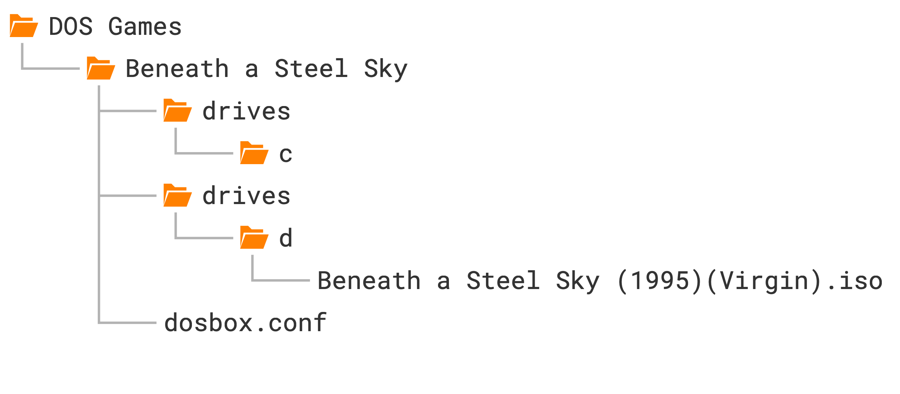

# Beneath a Steel Sky

The next game we're going to set up is [Beneath a Steel
Sky](https://www.mobygames.com/game/386/beneath-a-steel-sky/), a cyberpunk
sci-fi adventure game from 1994. It's one of the standout timeless classics of
the adventure genre, and best of all, Revolution Software released the game as
freeware in 2003 (see their accompanying notes [here](bass-readme.txt)).


## Launching games more easily

Before we delve into the setup instructions, a few words about launching our
growing collection of games more easily. Having to navigate to the game's
folder every time we want to launch gets old fast. Here's how to skip this
step:

#### Windows

1. Create a batch file called `Start DOSBox Staging.bat` with the following
    content:

    ```
    C:\Users\%USERNAME%\AppData\Local\DOSBox\dosbox.exe
    ```

    That's the default installation path chosen by the installer. `%USERNAME%`
    is your Windows user name. If you installed DOSBox Staging to a different
    folder, adjust the path accordingly.

2. Copy this batch file into your individual game folders and rename them to
   the names of the games (e.g., `Prince of Persia.bat`).

3. Right-click on the batch file icon and select **Send to --> Desktop (create
   shortcut)** in the context menu.

4. Now you can double-click the new **Prince of Persia.bat – Shortcut** icon
   on your desktop to start the game (you can rename the icon to whatever you
   like; this won't change the name of the batch file it references).


#### macOS

You can rename the **Start DOSBox Staging** icons in the individual game
folders to the names of the games, then use Spotlight Search to start a game.

For example, rename **Start DOSBox Staging** in the `Prince of Persia` folder
to **Prince of Persia**. Start Spotlight Search with ++cmd+space++, type in
"Prince", and press ++enter++ on the result to launch the game.


#### Linux

The easiest way is to create a shell script with the following content
(modify the path passed to `--working-dir` so it points to your game
directory):

```bash
#!/bin/bash
dosbox --working-dir "$HOME/Documents/DOS Games/Prince of Persia"
```

Then create a desktop icon that launches this script, or start it using your
desktop environment's preferred launcher.


## Mounting a CD-ROM image

We will set up the liberated "talkie" CD-ROM version of the game that has
full voice-acting. Create a new `Beneath a Steel Sky` subfolder inside your
`DOS Games` folder, then the usual `drives/c` subfolder within it. Download
the [ISO CD-ROM
image](https://archive.org/download/Beneath_a_Steel_Sky_1995_Virgin/Beneath%20a%20Steel%20Sky%20%281995%29%28Virgin%29.iso)
from the [Beneath a Steel
Sky](https://archive.org/details/Beneath_a_Steel_Sky_1995_Virgin) item at the
Internet Archive and put the `.iso` file into a new `drives/d` subfolder
inside your `Beneath a Steel Sky` game folder.

Also grab the scan of the [Security
Manual](https://archive.org/details/beneath-a-steel-sky-security-manual/) and
the [comic
book](https://ia802200.us.archive.org/13/items/beneath-a-steel-sky-comic-book/Beneath_a_Steel_Sky.pdf)
included in the boxed version of the game.

For the visually inclined, this is the structure we'll end up with:

{ .skip-lightbox style="width: 28rem; margin: 0.3rem max(calc((50% - 28rem/2) * 0.85), 0rem);" }

Our C: drive is the hard drive, so the CD-ROM drive uses the letter D: by
convention. Just like the `drives/c` auto-mounting mechanism we've seen
before, the CD image in the `drives/d` folder auto-mounts as the D: drive.


## Installing the game

Most games that come on CD images must be installed on the hard drive first.
Usually there's an executable called `INSTALL.EXE` or `SETUP.EXE` in the root
directory of the CD (the extension could be `.COM` or `.BAT` as well).

Switch to the D: drive with `d:`, then run `dir` to inspect the contents of
the CD:

``` { . .dos-prompt }
 Volume in drive D is BASS
 Directory of D:\

INSTALL  EXE                  28,846 06/15/1994  8:56a
README   TXT                   1,569 09/08/2005  1:34a
SKY      DNR                  40,796 07/07/1994  8:40a
SKY      DSK              72,429,382 07/07/1994  8:40a
SKY      EXE                 402,622 07/07/1994  7:21a
SKY      RST                  53,720 07/07/1994  7:19a
                6 file(s)            72,956,935 bytes
                0 dir(s)                      0 bytes free
```

We have two `.EXE` files and one text file. `README.TXT` just contains some
legal notice we don't need to worry about (view it with `more README.TXT` if
you're curious). `INSTALL.EXE` is what we're after, so run that.

We're greeted by a pretty standard-looking text-mode installer. Either press
any key or wait a few seconds to progress to the second screen, where you
select the installation path:

{{ figure(
    "https://www.dosbox-staging.org/static/images/getting-started/bass-setup1.png",
    alt="Beneath a Steel Sky setup -- Installation path",
    small=False,
    width="80%"
) }}

You can navigate the interface with the cursor keys, ++esc++, ++enter++, and
the mouse. The default `C:\SKY` install location is fine, so just accept it
with ++enter++.

The installer then takes us to the setup screen, where we choose the language
of the in-game text (voice-acting is English-only) and the sound settings:

{{ figure(
    "https://www.dosbox-staging.org/static/images/getting-started/bass-setup2.png",
    alt="Beneath a Steel Sky setup -- Game settings",
    small=False,
    width="80%"
) }}

English is fine, and the game has auto-detected our sound card correctly
(Sound Blaster 16 --- the card DOSBox emulates by default), so accept these
settings. Now the counterintuitive part: to finish the installation and save
the settings, we need to press the *Exit Install* button, which takes us to
the (guess what?) *Exit Install* dialog:

{{ figure(
    "https://www.dosbox-staging.org/static/images/getting-started/bass-setup3.png",
    alt="Beneath a Steel Sky setup -- Finalising the setup",
    small=False,
    width="80%"
) }}

Here you need to press **Save Setup** to finalise the settings and exit the
installer.

As you can see, this is not exactly a masterclass in user interface design,
but it does the job. Expect many DOS-era install and setup utilities to be
similarly slightly illogical --- often, it's not completely obvious what to do,
but it's not too hard to figure out either. Reading the manual or some trial
and error might help, too.

Anyway, after pressing **Save Setup**, the installer will exit and print out the
following instructions:

``` { . .dos-prompt }

BENEATH A STEEL SKY has been installed to directory:

C:\SKY


To run the game type:

C:
CD \SKY
SKY

```

Alrighty, let's do as the computer says! It's the easiest to put the above
commands into the `[autoexec]` section of our config, but let's comment the
last `sky` command out for now by preceding it with a `#` character because we
don't want to start the game just yet:

```ini
[autoexec]
c:
cd \sky
#sky
```

## Changing the current directory

So what is this `cd \sky` command? Does it have something to do with the `cd`
subfolder where we put our CD-ROM image?

No, that's just a coincidence. `cd` stands for **change directory** --- it
changes the current directory, which is displayed as part of the DOS prompt.
Let's break down these lines:

```
c:
cd \sky
```

The first command `c:` switches to the C: drive (the current drive is the
special built-in Z: drive when DOSBox starts). The second, `cd \sky`, changes
the current directory to the `sky` directory at the root of C:. `cd sky`
would also work, since the current directory is already root right after
switching drives.

How do you go up a level? `cd ..` (two dots for "parent directory", one dot
for "current directory").

``` { . .dos-prompt }
C:\SKY>cd ..
C:\>_
```

Straight to root? `cd \` (the backslash means "root directory").

``` { . .dos-prompt }
C:\SKY>cd \
C:\>_
```

You can also jump straight to a nested subdirectory in one command, e.g. if
you have `one\two\three`, you can go there directly from anywhere with `cd
\one\two\three` (imaginary example):

``` { . .dos-prompt }
C:\SKY>cd \one\two\three
C:\ONE\TWO\THREE>_
```

Play around with the drive and directory commands, then uncomment the last
`sky` command in `[autoexec]` (remove the `#`).

!!! warning

    You cannot switch drives with `cd` (e.g. `cd z:` or `cd z` won't work) ---
    you must use the drive letter followed by a colon (`z:`). If you run `cd
    z`, DOS will try to enter a folder called `z` in the current directory and
    error out if it doesn't exist.


## Adjusting volume levels

After starting the game, don't watch the intro yet --- press ++esc++ to jump
straight to the opening scene. There's music playing, so far so good. Move
the cursor over the door on the right, and when it turns into a crosshair and
"Door" appears, click it. You'll hear our protagonist speak --- but barely
audible, since the music is too loud.

There are a couple of ways to fix that. You can press ++f5++ to bring up the
game's options dialog where you can lower the music volume, but that would
make the total audio output too quiet. Worse yet, the setting doesn't get
saved, so you'd need to do this every single time when starting up the game.

As we've [learned before](passport-to-adventure.md#sound-blaster-adlib-sound),
Sound Blaster games tend to use the card's OPL synthesiser for music and its
digital audio capabilities for speech. Since the OPL synth and digital audio
have their own dedicated mixer channels, their volumes can be adjusted
independently.

*"Wait a minute, what mixer channels now?!"*

DOSBox has an integrated audio mixer. Every emulated sound card has its own
channel(s), and "composite" devices like the Sound Blaster have two: one for
the OPL synthesiser, one for digital audio.

Execute the `mixer` command at the DOS prompt to view the current state of the
mixer:

{ loading=lazy }

The first channel is the `MASTER` channel; this is the summed output of all
other channels, and it's always present. Below that is the `CDAUDIO` channel,
the `OPL` and `PCSPEAKER` channels (you can guess these two, right?), and
finally, the `SB` channel, which is for the digital audio output of the Sound
Blaster.

The Sound Blaster card and PC speaker are enabled by default, which is why their
channels appear in the mixer. The `CDAUDIO` channel is added automatically
whenever we mount a CD-ROM image (as the CD image might contain audio tracks).

To adjust a channel's volume, use `mixer <channel> <percentage>`. To raise
`SB` to 500%:

``` { . .dos-prompt }
mixer sb 500
```

By default the command prints the new mixer state after the adjustment:

{ loading=lazy }

You can combine multiple channels in one line, e.g. setting `OPL` to 50% and
`SB` to 500%:

``` { . .dos-prompt }
mixer opl 50 sb 500
```

Run `mixer /?` or `help mixer` for the full list of commands.

Do we need to run these adjustments manually every time? Of course not ---
put them in `[autoexec]`. The `/noshow` argument suppresses the mixer state
printout, which we don't need in an automated startup script.

```ini
[autoexec]
c:
cd sky
mixer opl 50 sb 500 /noshow
sky
```

## Changing the emulated Sound Blaster model

DOSBox emulates the **Sound Blaster 16** by default. This card can emulate all
earlier Sound Blaster models and offers the widest compatibility with DOS
games.

But back in the day there were more Sound Blaster variants and clones than
you could shake a stick at, many with quite different default volume levels.
We don't know which model this game's developers used, so it's worth trying
a few. Let's start with a first-revision **Sound Blaster Pro**:

```ini
[sblaster]
sbtype = sbpro2
```

We want to hear how the **Sound Blaster Pro 2** sounds with the default,
unaltered volume levels, so make sure to comment out the previously added
`mixer` command in the `[autoexec]` section by prefixing it with a `#`
character:

```ini
[autoexec]
c:
cd sky
#mixer opl 50 sb 500 /noshow
sky
```

This simple change alone does the trick: the speech can now be heard clearly
over the music, and the overall volume is good too! You can still fine-tune
individual channel volumes with `mixer` if you like.


## Disabling the Sound Blaster mixer

Another option: don't let the game mess with the OPL and digital audio
volumes at all. Starting from the Sound Blaster Pro 1, programs can alter the
card's internal mixer levels, but we can disable that with `sbmixer`.
Comment out `sbtype` (back to the default SB16) and keep the `mixer` command
in `[autoexec]` commented out too:

```ini
[sblaster]
#sbtype = sbpro2
sbmixer = off
```

Well, that's another way to fix the issue --- the speech is now loud and
clear!

But it's a bit too loud. While the balance between the music and speech was
just perfect on the Sound Blaster Pro 2, the speech is now overpowering the
music. Compensating for that by lowering the `SB` channel's volume in the
mixer is certainly an option, but we can conclude the developers must have
tuned the volume levels for a Sound Blaster Pro, so setting `sbtype = sbpro2`
is the best solution.


!!! warning "When the game knows best"

    Not letting a game adjust volume levels can sometimes backfire, e.g. in a
    game that intelligently lowers OPL music whenever speech is playing. But
    it's worth a shot --- some games benefit from wrestling control from them
    and putting the mixer into "manual mode".


## Adjusting the emulated CPU speed

If you *did* watch the intro (which I told you to skip, but no hard
feelings), you'll have heard severe audio stuttering from the moment the
narrator starts speaking. If you haven't, watch it now!

What's happening? DOS gaming spans almost two decades, with wildly different
CPU speeds in use throughout (see [CPU](../manual/system/cpu.md) for the full
reference). DOSBox doesn't emulate a specific CPU, just a "generic" one --- so
how does it know what speed to run a given game at?

It doesn't.

DOS games fall into two categories: older, real-mode games and newer,
protected-mode games. CPU-hungry games (FPS titles, flight sims) tend to be
protected mode, while pre-1993 real-mode games are generally much less
demanding. Figuring out the exact CPU speed a game needs is nearly
impossible, but detecting real vs. protected mode is trivial, so DOSBox does
automatic speed calibration by default:

- **Real mode** games: **3000** CPU instructions per millisecond (roughly a
  386SX at 20 MHz)
- **Protected mode** games: **60,000** instructions per millisecond (roughly
  a Pentium at 90 MHz)

The reasoning: older games are often sensitive to CPU speed and might
misbehave if it's too fast, hence the conservative default; newer games
benefit from extra speed and generally tolerate faster processors fine.

This gets all games *running*, but manual tweaking is often needed to make a
particular game run *smoothly*. Protected-mode games at "too high" cycle
counts are especially problematic since there's not enough headroom left for
glitch-free audio --- there's no point emulating a faster CPU than the game
needs, since that extra power could go toward smoother audio instead.

Beneath a Steel Sky is a protected-mode game --- how do we know? Comment out
the `sky` command in `[autoexec]`, launch DOSBox Staging windowed, and check
the title bar. DOSBox itself always starts in real mode:

```ini
DOSBox Staging - 3000 cycles/ms - to capture the mouse press...
```

That matches the real-mode default of 3000 cycles/ms. Now run `sky` and watch
the title bar change:

```ini
SKY.EXE - 60000 cycles/ms - to capture the mouse press...
```

`SKY.EXE` is now running, and it's at 60,000 cycles/ms --- our protected-mode
default, confirming this is a protected-mode game.

That's the crux of the stuttering: not enough horsepower left for
time-critical audio. The fix is to cap the cycle count instead of letting
DOSBox run wild. `cpu_cycles` sets real-mode cycles, `cpu_cycles_protected`
sets protected-mode cycles:

```ini
[cpu]
cpu_cycles_protected = 25000
```

Restart DOSBox Staging and watch the intro again --- the audio glitches
should be gone. Well done, time for a beer (or your beverage of choice)!
:sunglasses: :beer:

!!! info "Real and protected mode"

    In simple terms, **real mode** is the legacy 16-bit mode of a 386 or
    later CPU, while **protected mode** takes full advantage of its
    capabilities in 32-bit mode. Protected mode couldn't be widely used until
    386+ CPUs became common, around 1993; games from then on use it almost
    exclusively.

    You can spot protected-mode games by the presence of [DOS
    extenders](https://en.wikipedia.org/wiki/DOS_extender) like
    `DOS4GW.EXE`, `PMODEW.EXE`, or `CWSDPMI.EXE` in their game directories,
    and by characteristic startup messages. But you don't need to worry about
    any of that --- DOSBox tells you with 100% accuracy via the title bar, so
    just leave `cpu_cycles`/`cpu_cycles_protected` at their defaults (or set
    custom values) and watch the title as the game runs.


### Finding the correct speed for a game

Okay, so why set `cpu_cycles_protected` to 25&thinsp;000 and not any other number? The game's manual states
that a 386 or better processor is required. Indeed, the game works fine at
6000 cycles, which approximates a 386DX CPU running at 33 MHz, but the loading
times are a bit on the slow side. Setting the CPU cycles to
25&thinsp;000 --- which roughly corresponds to a 486DX2/66 --- speeds up the
loading considerably without causing any negative side effects. This is not
surprising as the DX2/66 was one of the
most popular CPUs in the 1990s for gaming. This is [what Wikipedia says about
it](https://en.wikipedia.org/wiki/Intel_DX2#:~:text=The%20i486DX2%2D66,performance%20and%20longevity.):

> The i486DX2-66 was a very popular processor for video game enthusiasts in
> the early to mid-90s. Often coupled with 4 to 8 MB of RAM and a VLB video
> card, this CPU was capable of playing virtually every game title available
> for years after its release, right up to the end of the MS-DOS game era,
> making it a "sweet spot" in terms of CPU performance and longevity.

The following table gives you reasonable rough cycles values for the most
popular processors:

<div class="compact center-table" markdown>

| Emulated CPU      |    MHz | Cycles | Year
|-------------------|-------:|-------:|-----:
| 8088              |   4.77 |    300 | 1981
| 286               |      8 |    700 | 1984
| 286               |     12 |   1500 | 1986
| **286**           | **25** | **3000** | **1988**
| 386DX             |     25 |   4500 | 1988
| 386DX             |     33 |   6000 | 1989
| 486DX             |     33 | 12&thinsp;000 | 1990
| 486DX2            |     66 | 25&thinsp;000 | 1992
| 486DX4            |    100 | 35&thinsp;000 | 1994
| Intel Pentium     |     90 | 50&thinsp;000 | 1994
| Intel Pentium     |    100 | 60&thinsp;000 | 1994
| Intel Pentium MMX |    166 | 100&thinsp;000 | 1997
| Intel Pentium II  |    300 | 200&thinsp;000 | 1997

</div>

You can also look this table up in the online help via `cpu_cycles /?`.

Treat these values as starting points only --- accurately emulating any given
processor's speed isn't really possible, given the "abstract" nature of
DOSBox's CPU emulation. In practice, though, that doesn't matter much: you
just need to find the cycles value the game works well with.

For 2D games from the 90s, an emulated 486DX2/66 handles anything you throw
at it. For 3D games you'll likely need Pentium or Pentium MMX levels, and
Pentium II speeds for 3D SVGA gaming at 640×480 or higher. For older
real-mode games, the default 3000 cycles is a good starting point, but try
the 300–10,000 range if it needs improvement.

You can fine-tune cycles live with ++ctrl+f11++/++ctrl+f12++ (++cmd+f11++/
++cmd+f12++ on Mac) --- these increase cycles by 10% or decrease by 20%
respectively. Once you land on a good setting, update your config with the
value shown in the title bar.

Always aim for the minimum cycles value that gives adequate performance, to
conserve host CPU power and reduce the odds of audio glitches --- overdoing
it only makes things worse. See also this [list of CPU speed sensitive
games](https://www.vogonswiki.com/index.php/List_of_CPU_speed_sensitive_games)
for further tips.


## Setting up Roland MT-32 sound

### Installing the MT-32 ROMs

You might have noticed the game offers a sound option called "Roland" in its
setup utility. What this refers to is the Roland MT-32 family of MIDI sound
modules. These were external devices you could connect to your PC that offered
far more realistic and higher-quality music than any Sound Blaster or AdLib
sound card was capable of. They were the Cadillacs of DOS gaming audio for a
while (they were priced accordingly, too), and many find they still sound
excellent even by today's standards. The [MIDI](../manual/sound/midi.md)
chapter explains how MIDI works and how to
[choose the right device](../manual/sound/midi.md#which-midi-device-should-i-use)
for each game.

DOSBox Staging can emulate all common variants of the MT-32 family (see the
[Roland MT-32](../manual/sound/sound-devices/roland-mt-32.md) page
for the full documentation), but it requires ROM dumps of the original
hardware devices to do so. So first, we
need to download these ROMs [from here](https://archive.org/details/Roland-MT-32-ROMs)
as a ZIP package, then copy the contents of the archive into our designated
MT&#8209;32 ROM folder:

<div class="compact" markdown>

| <!-- --> | <!-- -->
|----------|----------
| **Windows** | `C:\Users\%USERNAME%\AppData\Local\DOSBox\mt32-roms\`
| **macOS**   | `/Users/<USERNAME>/Library/Preferences/DOSBox/mt32-roms/`
| **Linux**   | `$HOME/.config/dosbox/mt32-roms/`

</div>

If the above download link doesn't work, search for *"mt32 roms mame"* and
*"cm32l roms mame"* in your favourite search engine and you'll figure out the
rest...

After copying the ROM files, start DOSBox Staging and run `mixer /listmidi`.
This verifies your ROM files and prints a **`y`** below each detected MT-32
version, with the currently selected one shown in green:

{ loading=lazy }


### Selecting the MT-32 version

As you might have guessed already, you can tell DOSBox Staging to emulate an
MT-32 model of a specific revision. In practice, these two models will cover
99% of your gaming needs:

`cm32l`
: Unless a specific model is requested, DOSBox Staging emulates the Roland
  CM-32L by default, for the best overall compatibility. This is a 2nd-gen
  MT-32 with 32 additional sound effects many games use. Studios like
  LucasArts tended to favour the CM-32L, so their games sound a bit better on
  it.

`mt32_old`
: Most older games --- notably the entire early Sierra adventure catalogue ---
  need a 1st-gen MT-32 and will refuse to work correctly, or sound wrong, on
  anything else. Use `mt32_old` for those.

```ini
[midi]
mididevice = mt32

[mt32]
model = cm32l
```

How do you figure out which model a particular game needs? You can't easily
do that without research and trial and error, but thanks to some dedicated
individuals, there's a [list of MT-32-compatible computer
games](https://www.vogonswiki.com/index.php/List_of_MT-32-compatible_computer_games)
that tells you the correct model for most well-known titles.

Let's consult the list and see what it says about Beneath a Steel Sky!

> Requires CM-series/LAPC-I for proper MT-32 output. Buffer overflows on
> MT-32 'old'. Combined MT-32/SB output only possible using ScummVM

Well, the list knows best, so we'll use the CM-32L for our game (as we've done
in the above config example).

To appreciate the difference, you can try running the game with the
`mt32_old` model after you have successfully set it up for the `cm32l`.
You'll find the sound effects in the opening scene sound a lot better on the
CM-32L.


### Configuring the game for the MT-32

So now DOSBox Staging emulates the CM-32L, but we also need to set up the game
for "Roland sound". (They could've been a bit more precise and told us the
game works best with the CM-32L, couldn't they? It's not even mentioned in the
manual!)

Many games have a dedicated setup utility in the same directory where the main
game executable resides. This is usually called `SETUP.EXE`, `SETSOUND.EXE`,
`SOUND.EXE`, `SOUND.BAT`, or something similar. There is no standard; every
game is different. You'll need to poke around a bit; a good starting point is
to list all executables in the main game folder with the `dir *.exe`, `dir
*.com`, and `dir *.bat` commands or the `ls` command and attempt running the
most promising-looking ones. The manual might also offer some helpful
pointers, and so can the odd text file (`.TXT` extension) in the installation
directory or the root directory of the CD (if the game came on a CD-ROM).
Certain games have a combined installer and setup utility, usually called
`INSTALL.EXE` or `SETUP.EXE`, which can be slightly disorienting for people
with modern sensibilities. You'll get used to it.

This particular game turns things up a notch and does *not* copy the
combined installer-and-setup utility into `C:\SKY` as one would rightly expect. To
reconfigure the game, you'll need to run `INSTALL.EXE` from the CD, so from the
D: drive (I've told you --- setting up the game itself is often part of the
adventure!).

So let's do that. As we've already installed the game on our C: drive, we'll
need to press ++esc++ instead of ++enter++ in the first **Path Selection
Window**. Not exactly intuitive, but whatever. Now we're in the **Setup Menu**
screen, where we can change the language and configure the sound options.
Select **Roland** sound, then press the **Exit Install** and **Save Setup**
buttons to save your settings (don't even get me started...).

Okay, now the moment of truth: start the game with the `sky` command. If
nothing went sideways, we should hear the much-improved, glorious MT-32
soundtrack! Now we're cooking with gas!

So let's inspect our favourite door one more time by moving the cursor over it
and then pressing the left mouse button --- hey, where did the voice-over go?!
Yeah... you've probably glossed over this little detail in the tip from the
MT-32 wiki page:

> Combined MT-32/SB output *only possible* using ScummVM
{ style="margin: 1.3rem 0" }

What this means for us ordinary mortals is that the original game can either
use the MT-32 for MIDI music and sound effects, and you get *no* digital
speech, or only the Sound Blaster for OPL music, digital sound effects, *and*
speech. MT-32 MIDI music and sound effects combined with digital
speech via the Sound Blaster --- the computer says no, buddy.

The game has just taught us an important life lesson: you can't have
everything, especially not in the world of older DOS games. You'll have to
pick what you value most: better music and only subtitles or full
voice-acting with a slightly worse soundtrack. I'm opting for the latter, and
remember, we can always enhance the Sound Blaster / AdLib music by adding
chorus and reverb. This will get us a little bit closer to the MT-32
soundtrack:

```ini
[mixer]
reverb = large
chorus = strong
```

### Getting MT-32 music with speech (after all)

Except some people go, "Yeah, screw life lessons, I won't have it!" Believe it
or not, some people are still creating patches for 30-year-old DOS games to
improve them in various ways. One such distinguished gentleman found a way to get
MT-32 music and Sound Blaster digital speech and sound effects playing at the
same time in Beneath a Steel Sky, so we'll use his patch to get the most out
of the game.

Download the `skydrv.zip` from
[here](https://www.vogons.org/viewtopic.php?p=1276241#p1276241), unzip it, and
then copy `skydrv.com` into `drives/c/SKY`. As per the forum post, you can run
the patched game from the mounted CD with this command:

```
d:
c:\sky\skydrv cfg=c:\sky
```

Skip the intro and inspect the door again. Whoa, magic! MT-32 music _and_
speech at the same time! Yikes! :sunglasses: Best put this into our
`[autoexec]` section!


## Aspect ratio correction

We're on a roll --- from audio to graphics next! If you've checked out the
included comic book (you should!) and have a keen eye, you might notice the
images in the intro sequence, scanned from the comics, appear vertically
stretched on-screen --- exactly 20% taller than they should be (trust me on
this for a moment).

Where's this 20% stretch coming from? DOSBox Staging enables **aspect ratio
correction** by default, making 320×200 graphics appear as they would on a
4:3 aspect ratio VGA monitor, which requires pixels drawn 20% taller. That's
the sensible default, since correction is *absolutely needed* for most DOS
games to look right --- but this game is one of the exceptions. The tell-tale
sign is that the intro artwork was scanned using square pixels, so we need to
disable correction for such games; with it off, we always get square pixels
(1:1 pixel aspect ratio). This is explained in more detail in the [Aspect
ratios &
scaling](../manual/graphics/rendering/aspect-ratios-and-scaling.md) section
of the manual.

{{ figure(
    "https://www.dosbox-staging.org/static/images/getting-started/bass-aspect.jpg",
    alt="Left: Screenshot from the intro with aspect ratio correction disabled (square pixels)<br>Right: The original image from the comic book included with the game",
    small=False,
    width="90%"
) }}

That's easy to fix; we'll also set the viewport resolution for roughly 4x
integer scaling, since the game would look too blocky stretched to
fullscreen:

```ini
[render]
aspect = square-pixels
viewport = 1280x800
```

<div class="image-grid" markdown>
{{ figure(
    "https://www.dosbox-staging.org/static/images/getting-started/bass-ingame1.jpg",
    "Beneath a Steel Sky with aspect ratio correction disabled"
) }}
{{ figure(
    "https://www.dosbox-staging.org/static/images/getting-started/bass-ingame2.jpg",
    "Well, we won't escape this way..."
) }}
</div>

This would've been a misguided effort if it only fixed the intro but not the
in-game visuals --- fortunately, both were drawn assuming square pixels. The
floppy disk icon, for instance, looks like a tallish rectangle with aspect
correction enabled, when it should be a perfect square; human figures and
circular objects appear slightly elongated too. Revolution was a European
studio, released the game for PAL Amigas (which have square pixels), and was
generally Amiga-first --- for such games, disabling aspect ratio correction
is almost always correct.

Rules of thumb:

**`aspect = on`**

- For most games primarily developed for DOS --- the DOSBox Staging default,
  and correct for the overwhelming majority of DOS games out of the box.
- For games primarily developed for the Amiga or Atari ST by a North American
  studio for the NTSC standard (even if made by a European studio but
  commissioned for the North American market).

**`aspect = square-pixels`**

- For most games primarily developed by European studios for the Amiga or
  Atari ST.

Notable European studios: *Bitmap Brothers, Bullfrog, Coktel Vision, Core
Design, DMA Design, Delphine, Digital Illusions, Firebird, Horror Soft /
Adventure Soft, Infogrames, Level 9, Magnetic Scrolls, Ocean, Psygnosis,
Revolution, Sensible Software, Silmarils, Team 17, Thalamus, Thalion,
Ubisoft*

!!! info "From squares to rectangles"

    For most 1980s/'90s games with 2D graphics, art was created once for the
    "leading platform" and reused across conversions --- drawing it multiple
    times in different aspect ratios wasn't economical.

    CRT monitors in the DOS era had a 4:3 aspect ratio, so in 320×200 mode
    pixels had to be 20% taller to fill the screen. DOSBox Staging does this
    correction by default, meaning DOS games assume a 1:1.2 pixel aspect
    ratio to look correct as intended. The full derivation is in [Aspect
    ratios &
    scaling](../manual/graphics/rendering/aspect-ratios-and-scaling.md).

    For games where the leading platform was Amiga/Atari ST and the studio
    was European, the analog TV standard was PAL. European Amigas were PAL
    machines with square pixels in the 320×256 mode most PAL Amiga games
    used. Studios drew art assuming square pixels but used only a 320×200
    portion of that 320×256 area. On PAL Amigas the art appeared correct but
    letterboxed; on NTSC Amigas and DOS PCs with 320×200 mode, it filled the
    screen but appeared stretched 20% vertically. No one complained, and it
    saved money, so this became common practice. Now you can enjoy these
    games in their intended aspect ratio by disabling DOSBox Staging's
    default correction.

!!! warning "Don't trust the circles!"

    Keener observers might notice the intro image on the left features a
    circle that only looks perfect with aspect correction *enabled*, in
    which case the comic-scanned image is stretched. With correction
    *disabled* the circle looks like a squashed oval, but the comic image
    looks right.

    The explanation: whoever drew that circle around the scanned image did
    so assuming 1:1.2 pixel aspect ratio, so it looked perfectly round to him
    on his VGA monitor.

    This is a common theme --- some games get assets added during porting,
    resulting in mixed aspect ratio assets within a single game, sometimes
    impossible to fully reconcile with one fixed pixel aspect ratio.

    Generally, you cannot trust the circles. Sometimes they'll look right
    with the correct settings, sometimes not. It's more reliable to judge
    aspect ratio by common objects, human bodies, and faces.


## Arcade monitor emulation

Now that we've brought up the Amiga, it's worth mentioning a fun, if not
quite authentic, feature of the CRT emulation!

Home computer and arcade monitors (15 kHz monitors), like the Commodore
monitors typically used with Amigas, were quite different from VGA CRTs.
They displayed low-resolution content with thick scanlines, similar to EGA
monitors, and were less sharp --- not great for text or spreadsheets, but it
flatters low-resolution pixel art.

Enable this fantasy mode with:

```ini
[render]
shader = crt-auto-arcade
```

Now you can play with Amiga-like graphics and MT-32 or OPL sound from a
strange parallel universe! 😎

{{ figure(
    "https://www.dosbox-staging.org/static/images/getting-started/bass-amiga.jpg",
    "Beneath a Steel Sky from a parallel universe running on an Amiga in 256-colour mode"
) }}


## Final configuration

Putting it all together, this is our final config:

```ini
[cpu]
cpu_cycles_protected = 25000

[sdl]
fullscreen = on

[render]
aspect = square-pixels
viewport = 1280x800

# uncomment for arcade monitor emulation
#shader = crt-auto-arcade

[sblaster]
sbmixer = off

[midi]
mididevice = mt32

[mixer]
reverb = large
chorus = strong

[autoexec]
# original game
#c:
#cd sky
#sky

# patched game (MT-32 music & SB speech/sfx)
d:
c:\sky\skydrv cfg=c:\sky

exit
```

The patched game is clearly superior, but you can still run the original:
uncomment the three lines below `# original game`, then comment out the two
lines after `# patched game`. You can switch between Roland MT-32 and Sound
Blaster/AdLib sound at will by reconfiguring the game via `INSTALL.EXE` ---
no further DOSBox config changes needed.

!!! note "About reverb presets"

    Enabling reverb and chorus does not add these effects to the MT-32's
    output --- that's undesirable, since the MT-32 has its own built-in
    reverb and chorus, and DOSBox Staging is smart enough not to double them
    up.

    The reverb presets add a small amount of reverb to the digital audio
    (PCM) outputs, like the `SB` channel, mostly to help it blend better with
    the synthesiser's output (e.g. the `OPL` channel), which has a more
    prominent reverb.
