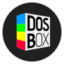

---
hide:
  - footer
---

# About

[{ align=right width=40% }](https://dosbox-staging.github.io/)

**DOSBox Staging** is a modern continuation of DOSBox with advanced features
and current development practices.

It is meant as a (mostly) drop-in replacement for older DOSBox versions---your
existing configurations will continue to work, but you will have access to
many advanced features.

Because **DOSBox Staging** comes with sensible defaults, you'll need to write
a lot less configuration than with older DOSBox versions. Most games and
application software require no tweaking and will work fine with the stock
settings. However, the extensive configuration options and advanced features
are available if you wish to dwelve deeper.

## Goals

- Improve the **out-of-the-box** experience for new users.
- Encourage **new contributors** by removing barriers to entry.
- Implement **new features** and quality-of-life improvements.
- Fix, clean up, and integrate notable **community-developed patches** that
  fill valuable general-purpose and/or gaming-focused emulation holes
  (provided they don't impact broader compatibility, performance, stability,
  or code maintainability).
- Prioritize the **quality** of newly written code to minimize technical
  debt and ease future maintenance, which generally means following the
  [Staging Coding Style
  Guide](https://github.com/dosbox-staging/dosbox-staging/blob/main/CONTRIBUTING.md#coding-style)
  and being aware of best practices, like the [C++ Core
  Guidelines](http://isocpp.github.io/CppCoreGuidelines/CppCoreGuidelines).
- Deliver a consistent cross-platform experience.
- Leverage upstream and community developments in DOSBox.
- Focus on supporting up-to-date, current operating systems and modern
 hardware.

A summary of technical and feature differences is
[here](https://github.com/dosbox-staging/dosbox-staging#summary-of-features).

We plan to add the features listed in [the
backlog](https://github.com/dosbox-staging/dosbox-staging/projects/3).

## Non-goals

- Support old operating systems (Windows 9x/Me/XP, OS/2, and Mac OS X 10.5)
  and limited CPU/memory hardware, which are constraints
  [DOSBox](https://www.dosbox.com/) continues to support.

- Support the use of Windows 9x/Me in the emulator. Windows 9x/Me emulation
  is supported by projects such as [QEMU](https://www.qemu.org) and
  [VirtualBox](https://www.virtualbox.org/), although DOSBox forks like
  [DOSBox-X](https://www.dosbox-x.com/) and [DOSBox
  Pure](https://github.com/schellingb/dosbox-pure) also support this. This
  may change if wanted by the DOSBox Staging community in general.

- Pursue hardware accuracy when it impacts the above goals or detracts
  from the source material, although config options may be added in case of
  issues. If you need perfect emulation in terms of accuracy, you may look at
  [PCem](https://pcem-emulator.co.uk/) and its derivatives like
  [86Box](https://86box.net) and [PCBox](https://pcbox.github.io/), which
  are examples of cycle-accurate emulators.

- Be the fastest DOS emulator on x86 hardware. Linux users interested in
  emulation speed should look at [dosemu2](https://github.com/dosemu2/dosemu2).

- Act as a general-purpose DOS operating system. For that, there is
  [FreeDOS](https://www.freedos.org/).

## Relationship to DOSBox

**DOSBox Staging** is separate from and not supported by the
SourceForge-hosted [DOSBox](https://www.dosbox.com/) project or its
development team, the DOSBox Team.

We acknowledge and are thankful for the work shared by all DOSBox
contributors.

## Team

This project is maintained by the [DOSBox Staging
team](https://github.com/orgs/dosbox-staging/people).

## License

  

Content on this site is licensed under a
[Creative Commons Attribution-ShareAlike 4.0 International License](https://creativecommons.org/licenses/by-sa/4.0/).

DOSBox Staging is licensed under a [GNU GPL version 2 or later](https://www.gnu.org/licenses/old-licenses/gpl-2.0.html).
