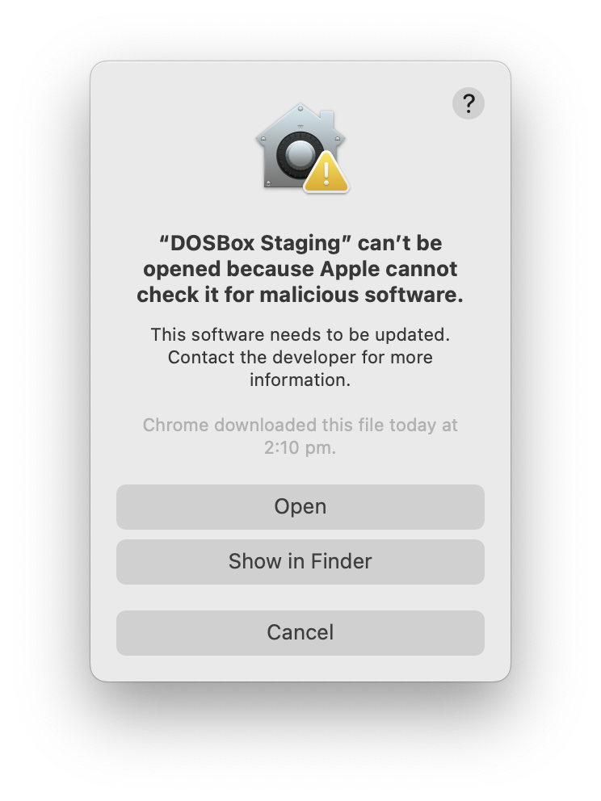

---
hide:
  - footer
---

# macOS builds

**[Download DOSBox Staging 0.80.1 Universal Binary (dmg)][0_80_1]**
 
<small>
sha256: 46a256645255e8345981ea357f1416b8<wbr>ce4bc60a2aba9a86b5122d5075aa7fa
</small>

This package is compatible with macOS 10.15 (Catalina) or newer and supports both
Intel and M1 Macs.

Check out the [0.80.1 release notes](release-notes/0.80.1.md) to learn about
the changes and improvements introduced by this release.

!!! important

    macOS uses its Gatekeeper feature to prevent users from running
    externally-hosted 3rd party software, such as DOSBox Staging. See [the section
    below](#apple-gatekeeper) to learn how to fix it.

    [1]:https://github.com/dosbox-staging/dosbox-staging

## Homebrew

The [Homebrew package](https://formulae.brew.sh/formula/dosbox-staging) is
compatible with macOS 10.14 (Mojave) or newer. Learn how to set up Homebrew
[here](https://mac.install.guide/homebrew/).

    brew update
    brew install dosbox-staging

## MacPorts

The [MacPorts package](https://ports.macports.org/port/dosbox-staging/)
should build on systems as old as macOS 10.6 (Snow Leopard, circa 2009) or newer.
Learn how to set up MacPorts [here](https://guide.macports.org/).

    sudo port selfupdate
    sudo port install dosbox-staging

If you're running an OS not longer maintained by Apple, then support is on a
best-effort basis (as the team runs supported configurations and may not be able
to reproduce some issues).

## Hardware requirements

For x86 CPUs the SSE 4.2 instruction set is required. For Intel Mac models
that don't support it, you can try using the partial SSE4.2 emulator
[MouSSE](https://forums.macrumors.com/threads/mp3-1-others-sse-4-2-emulation-to-enable-amd-metal-driver.2206682/).

## Development snapshot builds

You can always see what's cooking on the main branch! :sunglasses: :beer:

These [snapshot builds](development-builds.md) might be slow or unstable as they
are designed with developers and testers in mind.

## Apple Gatekeeper

You'll need to do the following when launching DOSBox Staging for the first
time (you'll need to repeat these steps every time after having upgraded to a
newer version):

- ++ctrl++ click (or right-click) on the **DOSBox Staging** app, and click **Open**. 
- Click **OK** to close the resulting message.
- Open the app a second time (as per above); now Gatekeeper will show an
  **Open** button like this:

<figure markdown>
  {width=400}
</figure>

### Explanation

Apple's Gatekeeper feature only permits the running of notarized software, one
aspect of which involves developers making yearly payments to Apple.

As DOSBox Staging is a volunteer effort, we are not in a position to make such
payments and therefore ask users to bypass Apple's Gatekeeper manually.

## Older builds

- [DOSBox Staging 0.80.0 Universal binary (dmg)][0_80_0] (macOS 10.15 or newer)
   
  <small>
  sha256: 53f12aa63cf9d2a33a46149fb394947c<wbr>6b12d5ab9b7ba41ee2d7eab1a990fa7a
  </small>

- [DOSBox Staging 0.79.1 Universal binary (dmg)][0_79_1] (macOS 10.15 or newer)
   
  <small>
  sha256: 52547692be29949747bb8d3b59bf31dd<wbr>22b4f49178316417cc8f1f468eeab387
  </small>

- [DOSBox Staging 0.79.0 Universal binary (dmg)][0_79_0] (macOS 10.15 or newer)
   
  <small>
  sha256: 1678f7458acabecdaf2b49e0d95a20d0<wbr>57734898b70c29d4e845f52a1aa26d46
  </small>

- [DOSBox Staging 0.78.1 Universal binary (dmg)][0_78_1_UB] (macOS 10.15 or newer)
   
  <small>
  sha256: b9ddff89e9fc283493580d5fc021b050<wbr>21a13d90305ae44e2867499b22e359c9
  </small>

- [DOSBox Staging 0.78.0 Universal binary (dmg)][0_78_0_UB] (macOS 10.15 or newer)
   
  <small>
  sha256: 3997546560af542b7f3b55b1bc890ae4<wbr>342144a72c21af9880449adf579db88b
  </small>

- [DOSBox Staging 0.77.1 x86-64 (dmg)][0_77_1_x64] (macOS 10.15 or newer)
   
  <small>
  sha256: 29964d79f0a85d593f8bafd30da854c7<wbr>26594c12474528f46758fc95c05f0c97
  </small>

- [DOSBox Staging 0.77.1 ARM64 (dmg)][0_77_1_arm64] (macOS 11 or newer)
   
  <small>
  sha256: 74a1c84bdda0db25091f749ba7a2e5e9<wbr>3f7849baf130817ea1bc182039bd3698
  </small>

- [DOSBox Staging 0.77.0 x86-64 (dmg)][0_77_0_x64] (macOS 10.15 or newer)
   
  <small>
  sha256: 3ca859573814b2c50065825c02d8a04e<wbr>b6d95605830ec3af21de0d64a2e32314
  </small>

- [DOSBox Staging 0.77.0 ARM64-testing (dmg)][0_77_0_arm64] (macOS 11 or newer)
   
  <small>
  sha256: e2eecb52777d5ed836ba1f772fe669c8<wbr>9e94ea9b67777aced5fef5b51051ccaf
  </small>

- [DOSBox Staging 0.76.0-3 (dmg)][0_76_0-3] (macOS 10.15 or newer)
   
  <small>
  sha256: f6048fa0e1a33a41f0018cb6d7139c4f<wbr>7b4a60176bbe6a42f681aa8b5adcb73b
  </small>

- [DOSBox Staging 0.76.0 (dmg)][0_76_0] (macOS 10.15 or newer)
   
  <small>
  sha256: c9fa7b0bf6410f430b47daeb15a470e0<wbr>105a147b555d3fbf574514406c71f492
  </small>

- [DOSBox Staging 0.75.2 (dmg)][0_75_2] (macOS 10.15 or newer)
   
  <small>
  sha256: 272f01aa8598ecf3229d48680aa6ce6e<wbr>5b88ebd0645b1f92b899bc0159afcf11
  </small>

- [DOSBox Staging 0.75.1 (dmg)][0_75_1] (macOS 10.15 or newer)
   
  <small>
  sha256: 2508a87c6aceee63da13e4c76159734e<wbr>3c9ee4e76fb22a3a7c0d66021e71a4eb
  </small>

- [DOSBox Staging 0.75.0 (dmg)][0_75_0] (macOS 10.15 or newer)
   
  <small>
  sha256: a0038c7401d239934d25517ca5e8e600<wbr>6cc3f4cb7060f6ace56609d36bca12ef
  </small>

- [DOSBox Staging 0.75.0-rc1 (dmg)][0_75_0_rc1] (macOS 10.15 or newer)
   
  
  sha256: 8a5c12d1b6567d6e981acd76e30dec41<wbr>a73a699963b714f4f1dcf0fc853fc9f6
  

[0_80_1]: https://github.com/dosbox-staging/dosbox-staging/releases/download/v0.80.1/dosbox-staging-macOS-v0.80.1.dmg
[0_80_0]: https://github.com/dosbox-staging/dosbox-staging/releases/download/v0.80.0/dosbox-staging-macOS-v0.80.0.dmg
[0_79_1]: https://github.com/dosbox-staging/dosbox-staging/releases/download/v0.79.1/dosbox-staging-macOS-v0.79.1.dmg
[0_79_0]: https://github.com/dosbox-staging/dosbox-staging/releases/download/v0.79.0/dosbox-staging-macOS-v0.79.0.dmg
[0_78_1_UB]: https://github.com/dosbox-staging/dosbox-staging/releases/download/v0.78.1/dosbox-staging-macOS-v0.78.1.dmg
[0_78_0_UB]: https://github.com/dosbox-staging/dosbox-staging/releases/download/v0.78.0/dosbox-staging-macOS-v0.78.0.dmg
[0_77_1_x64]: https://github.com/dosbox-staging/dosbox-staging/releases/download/v0.77.1/dosbox-staging-macOS-v0.77.1.dmg
[0_77_1_arm64]: https://github.com/dosbox-staging/dosbox-staging/releases/download/v0.77.1/dosbox-staging-macOS-arm64-0.77.1.dmg
[0_77_0_x64]: https://github.com/dosbox-staging/dosbox-staging/releases/download/v0.77.0/dosbox-staging-macOS-v0.77.0.dmg
[0_77_0_arm64]: https://github.com/dosbox-staging/dosbox-staging/releases/download/v0.77.0/dosbox-staging-macOS-arm64-0.77.0-testing.dmg
[0_76_0-3]: https://github.com/dosbox-staging/dosbox-staging/releases/download/v0.76.0/dosbox-staging-macOS-v0.76.0-3-g6525f.dmg
[0_76_0]: https://github.com/dosbox-staging/dosbox-staging/releases/download/v0.76.0/dosbox-staging-macOS-v0.76.0.dmg
[0_75_2]: https://github.com/dosbox-staging/dosbox-staging/releases/download/v0.75.2/dosbox-staging-macOS-v0.75.2.dmg
[0_75_1]: https://github.com/dosbox-staging/dosbox-staging/releases/download/v0.75.1/dosbox-staging-macOS-v0.75.1.dmg
[0_75_0]: https://github.com/dosbox-staging/dosbox-staging/releases/download/v0.75.0/dosbox-staging-macOS-v0.75.0.dmg
[0_75_0_rc1]:https://github.com/dosbox-staging/dosbox-staging/releases/download/v0.75.0-rc1/dosbox-staging-macOS-v0.75.0-rc1.dmg

## Building from source

Of course, you can always [build DOSBox Staging straight from the source][1].

Send us patches if you improve something! :smile:

[1]:https://github.com/dosbox-staging/dosbox-staging
