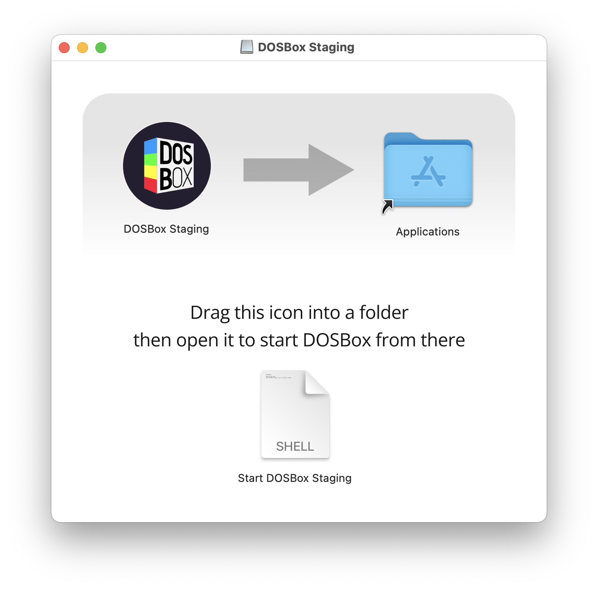

# 0.80.0 release notes

**Release date:** 2022-12-21

## Summary

[ReelMagic][reelmagic] DOS games are now playable thanks to the efforts of Jon
Dennis, Chris Guthrie, and Joseph Whittaker, with testing and feedback from
Vogons users Uka, DonutKing, and Vetz. Mouse emulation has been improved and
now supports up to six independent mice, enabling split-screen play in games
like [The Settlers][settlers1] and [The Settlers II][settlers2]. More
settings, including video, audio, and mixer effects, can now be changed on the
fly. Following macOS, high DPI support on multi-display setups now comes to
Windows. A new `--working-dir` command line flag allows DOSBox Staging to
launch from a specific working directory. Repo packagers should note that
**sdl2_image** is now a dependency.

[reelmagic]: https://en.wikipedia.org/wiki/RealMagic
[settlers1]: https://en.wikipedia.org/wiki/The_Settlers
[settlers2]: https://en.wikipedia.org/wiki/The_Settlers_II

Read on for all the details!


## How to upgrade

Get started by downloading the latest version and updating your configuration
file:

### Downloads

<div class="compact" markdown>

- [Linux](../linux.md)
- [Windows](../windows.md)
- [macOS](../macos.md)

</div>

### Upgrade your configuration file

1. Launch the new release.
2. At the`Z:\>` prompt, run `config -wc` to write the new configuration file.

!!! note

    - Existing settings will be retained, but extraneous comments will be
      dropped.

    - Starting with version 0.80, the configuration file is written in the
      language in which DOSBox Staging was started.

    - To write an English configuration file, launch with the `-lang en`
      command-line flag (to start DOSBox Staging in English) and then (re-)write
      your configuration file.


## New features

### ReelMagic support

DOS [ReelMagic][reelmagic] games are now playable thanks to Jon Dennis's
[patch](https://github.com/jrdennisoss/dosboxrm) with help from Chris Guthrie
and Joseph Whittaker.

See the `[reelmagic]` section in your configuration file to enable this. We
suggest only enabling ReelMagic emulation on an as-needed basis.

<figure markdown>
  <video controls width=100%>
    <source src="https://archive.org/download/dosbox-staging-v0.80.0-return-to-zork-intro-reelmagic/return-to-zork-intro-reelmagic.mp4" type="video/mp4">
    Your browser does not support the <code>video</code> element.
  </video>

  <figcaption markdown>
  Return to Zork (1995) --- introduction
  </figcaption>
</figure>

Jon plans to add DMA support (primarily used by the ReelMagic Windows 3.1x
driver and games) when time permits, but most ReelMagic games for DOS are
already fully functional and playable.


### Mouse improvements

#### Dedicated configuration section

The mouse configuration has been moved to its own section and additional
options have been added. A tool called `mousectl` is available on `Z:` for
more detailed per-interface mouse configuration.
 
#### Dual mouse gaming

Multiple physical mice can now be mapped to specific emulated mouse
interfaces, enabling two-player split-screen gaming ([The Settlers][settlers1]
and [The Settlers II][settlers2]) using two USB mice on a single computer.

See the [wiki
article](https://github.com/dosbox-staging/dosbox-staging/wiki/Dual-Mouse-Gaming)
for more details.

<figure markdown>
  <video controls width=100%>
    <source src="https://archive.org/download/dosbox-staging-v0.80.0-settlers-2-dual-mouse/settlers-2-dual-mouse.mp4" type="video/mp4">
    Your browser does not support the <code>video</code> element.
  </video>

  <figcaption markdown>
  The Settlers II (1996) --- showcasing dual-mouse gaming in action
  </figcaption>
</figure>


#### Improved support for third-party INT33 Windows mouse drivers
 
*javispedro*'s [INT33 mouse driver](https://git.javispedro.com/cgit/vbados.git/about/)
for Windows 3.1x is fully supported and no longer requires the use of the
separate DOS driver, except when booting from a disk image. The driver also
resolves compatibility issues with seamless mouse integration and adds mouse
wheel support.

See the [wiki
article](https://github.com/dosbox-staging/dosbox-staging/wiki/Windows-3.1x#improved-mouse-driver)
for more details.

#### Mouse-related help in the title bar

The title bar now displays some short help about the mouse, such as how it can
be captured or released.

### High DPI on Windows

Following macOS, high DPI support now comes to Windows: the DOSBox window
should scale nicely along other programs, and retain correct dimensions when
moving between monitors with different scaling factors set.

!!! note

    This feature is currently experimental! If you notice any weird behaviour,
    [please report it!](https://github.com/dosbox-staging/dosbox-staging/issues/new/choose)

### Ability to use local configs via Finder on macOS

A new `--working-dir <path>` command line parameter has been introduced to
make it possible to launch DOSBox Staging using local configs from the Finder
on macOS. Previously, you had to use DOSBox from the command line to achieve
this.
 
#### How to use it

Follow the steps indicated in the DMG package, as shown:

<figure markdown>
  
</figure>

Simply copy the included `Start DOSBox Staging.command` to any folder that
contains a local `dosbox.conf` and then open it (`Start DOSBox
Staging.command`) in Finder. DOSBox Staging will act as if started from that
folder and will pick up the local config.
 
!!! note

    You might be asked to give DOSBox Staging access to the containing folder
    upon the first launch---just click OK if that dialog comes up.

 
## General improvements

### `more.com` command

The `more` command is now internally implemented (should be more user-friendly
than the original DOS one), and its engine is used for displaying help
messages longer than one screen.

<figure markdown>
  <video controls width=100%>
    <source src="https://archive.org/download/dosbox-staging-v0.80.0-enhanced-more-command/enhanced-more-command.mp4" type="video/mp4">
    Your browser does not support the <code>video</code> element.
  </video>

  <figcaption markdown>
  more.com --- Better and Improved(tm)
  </figcaption>
</figure>


### On-the-fly changes

Several settings can be safely adjusted at runtime, including the output video
settings, resolution, OpenGL shaders, audio devices, and mixer settings.

<figure markdown>
  <video controls width=100%>
    <source src="https://archive.org/download/dosbox-staging-v0.80.0-plug-n-play-audio/plug-n-play-audio.mp4" type="video/mp4">
    Your browser does not support the <code>video</code> element.
  </video>

  <figcaption markdown>
  Reconfiguring audio on-the-fly --- changing sound cards in a PC has never
  been easier!
  </figcaption>
</figure>


### Post-rendered screenshots

DOSBox has long provided the ++ctrl+f5++ hotkey to capture the emulated video
card's image prior to rendering.

DOSBox Staging 0.80 now pairs this with ++alt+f5++ (or ++opt+f5++ on macOS) to
capture the as-seen (post-rendered) image.


### More bundled OpenGL shaders

The balance of usable shaders from [Tyrells' CRT shader
collection](https://github.com/tyrells/dosbox-svn-shaders), as well as
GranMinigun's interpolating Catmull–Rom spline shader have been added.

Launch DOSBox Staging with the `--list-glshaders` command-line argument to list
the available OpenGL shaders. For example:

```
List of available GLSL shaders
------------------------------

Path '/usr/src/dosbox-staging/build/resources/glshaders' has:
        |- crt/aperture
        |- crt/caligari
        |- crt/easymode
        |- crt/easymode.tweaked
        |- crt/fakelottes
        |- crt/fakelottes.tweaked
        |- crt/geom
        |- crt/geom.tweaked
        |- crt/hyllian-updated
        |- crt/hyllian
        |- crt/lottes-fast
        |- crt/lottes-fast.subtle+gain
        |- crt/lottes
        |- crt/lottes.tweaked
        |- crt/mattias
        |- crt/pi-vertical
        |- crt/pi
        |- crt/yee64
        |- crt/yeetron
        |- crt/zfast
        |- crt/zfast-composite
        |- interpolation/catmull-rom
        |- interpolation/sharp
        |- scaler/advinterp2x
        |- scaler/advinterp3x
        |- scaler/advmame2x
        |- scaler/advmame3x
        |- scaler/rgb2x
        |- scaler/rgb3x
        |- scaler/scan2x
        |- scaler/scan3x
        |- scaler/tv2x
        `- scaler/tv3x
```

??? note "Full PR list of additions and improvements"

    - Add `--working-dir` command line option (#2122)
    - Add a subset of OpenGL shaders from Tyrells' repo (#2137)
    - Add direct support for Windows 3.1 seamless mouse driver by javispedro (#1996)
    - Add libraries to support TrueType font rendering (#2075)
    - Add more cleanup on audio device tear-down (#2099)
    - Add mouse related hints to title bar (#2062)
    - Add release drafter support files (#2036)
    - Add screenshots for rendered output #2073) (#2078)
    - Allow to cancel interactive mouse mapping with a keyboard (#2067)
    - Bump actions/cache from 2 to 3.0.11 (#2025)
    - Bump actions/download-artifact from 2 to 3 (#2028)
    - Bump actions/upload-artifact from 2 to 3 (#2026)
    - Bump fountainhead/action-wait-for-check from 1.0.0 to 1.1.0 (#2027)
    - Bump microsoft/setup-msbuild from 1.1 to 1.2 (#2123)
    - Bump microsoft/setup-msbuild from 1.2 to 1.3 (#2129)
    - Check file-descriptor dependency for Enet, slirp, and ManyMouse (#2108)
    - Cleanup a handful of build issues for clang 10.x and 11.x (#2096)
    - Cleanup issues in ReelMagic flagged by Coverity (#2084)
    - Cleanup overcomplicated data conversions in Unicode support (#2104)
    - Cleanup string IDs of DOS programs (#2064)
    - Compiler warning fix in ManyMouse library (#2076)
    - Contribute a script to convert from YouTube chapters to CD-DA (#2037)
    - Customise the looks of the macOS DMG distribution disk image (#2127)
    - Debloat the binary: use more heap storage and retire the software scalar (#2101)
    - Drop architecture spec from setup-msbuild GitHub action (#2124)
    - Enable DPI scaling on Windows (#2105)
    - Fix a couple CWE issues in ManyMouse (#2040)
    - Fix sentence starting with lower case in MOUNT command help (#2068)
    - Generate linker map file by default (#2103)
    - Implement MORE.COM command (#2020)
    - Import Jon Dennis's ReelMagic emulation package #1112) (#2077)
    - Improve detection of atomics, testing of speexDSP, and cleanup README (#1992)
    - Improve interactive mouse mapping (#2065)
    - Improve management of audio devices (#2095)
    - Look for libXInput dependency (#2085)
    - Minor mouse enhancements (#2060)
    - Mouse mapper and configuration mechanism (#2000)
    - Refactor ReelMagic player with per-stream handle registration (#2086)
    - Refactor the ReelMagic audio FIFO class (#2090)
    - Simplifies file search in virtual drive (#2130)
    - Split contributed CD-DA scripts into fetch vs. cue functions (#2045)
    - Sync reSIDfp with upstream (#2092)
    - Update CI against latest deprecations and OS versions (#2031)
    - Update Tracy to v0.9 (#2069)
    - Update the build system wraps and automate CI action maintenance (#2024)
    - Update wraps and PVS Studio (#2097)
    - Use MORE engine for help output (#2079)
    - Use a `sdd::unique_ptr` to manage the video memory (#2116)
    - Use shared pointers to manage the virtual files (#2117)


## Bug and regression fixes

- The mixer's effects (reverb, chorus, and crossfeed) can now be turned on and
  off at runtime via the mixer command.

- FluidSynth's specific reverb and chorus configuration settings are now applied
  and will replace the default values that were previously always applied.

- The modem's call now has a warm-up period where it will discard data. This
  fixes a bug noted in **Duke Nukem 3D** where it would fail its initial
  handshake on the first try.

??? note "Full PR list of bug and regression fixes"

    - Adapt `update-sources.sh` script to UTF-8 locale (#2011)
    - Add modem call warm-up period (#2125)
    - Always use VFR presentation mode for text modes (#2139)
    - Avoid shifting negative DAC data in Sound Blaster (CWE-758) (#2115)
    - Capture the OpenGL screenshot using RGBA pixel format (#2143)
    - Change `config -wc` to write UTF-8 file (#1991)
    - Drop architecture spec from setup-msbuild GitHub action (#2124)
    - Fix FluidSynth reverb and chorus settings not applying (#2133)
    - Fix a memory leak in the keyboard layout class (#1985)
    - Fix assertion in mouse code for surface screen output (#2110)
    - Fix bitwise shift of negative in DOS date pack call (#2034)
    - Fix character D6 mapping in code page 3021 (Bulgarian MIK encoding) (#2094)
    - Fix several English strings too long to fit on screen (#1998)
    - Fix tab handling in MORE command (#2102)
    - Improve `mixer.com` CLI handling of volume and effect arguments (#2021)
    - Initialize the window's canvas size during its setup phase (#2038)
    - Limit `bit_view`s to 8-bit registers to avoid byte-order assumption (#1999)
    - MORE text output engine fixes (#2083)
    - Parse language options before writing the conf file (#2001)
    - Remove errorneous screen parameters check in mouse code (#2119)
    - Restore 0.79.1 mouse acceleration model in DOS driver (#2087)
    - Restore WheelHasMoved bit in DOS mouse driver to correct value (#2091)
    - Use non-throwing form of `std::filesystem` calls (#1995)


## Translation improvements

### Translations

<div class="compact" markdown>

* German: up-to-date
* Italian: up-to-date
* Polish: up-to-date
* Russian: up-to-date
* French: not updated
* Spanish: not updated

</div>

### Related improvements

- The title bar is now translatable.

- The Brazilian ABNT2 slash and question mark keys are now handled.

- Translations are now stored in UTF-8 and converted to the selected DOS
  codepage, dropping accents if needed, sometimes even performing crude
  transliterations (for Latin, Greek, and Cyrillic alphabets DOSBox
  shouldn't display garbled messages anymore regardless which codepage is
  selected). This is especially important for languages where more than one
  incompatible encoding was used in the DOS era. All FreeDOS codepages are
  supported. Note that only DOSBox Staging's own messages benefit from this
  feature.

??? note "Full PR list of documentation and translation changes"

    - Adapt `update-sources.sh` script to UTF-8 locale (#2011)
    - Add Dutch tranlation of MOUSECTL (#2042)
    - Add Dutch translation of MORE (#2048)
    - Add handling for ABNT2 slash/question mark key (by rsribeiro) (#2082)
    - Add release drafter support files (#2036)
    - Clarify `tandy` and `ibm5153` `cga_colors` config descriptions (#2074)
    - Cleanup string IDs of DOS programs (#2064)
    - Convert esc codes to ansi in src (#2008)
    - Delete obsolete translated msgs (#2058)
    - Fix character D6 mapping in code page 3021 (Bulgarian MIK encoding) (#2094)
    - Fix code page 30020 to UTF-8 mapping (#1988)
    - Fix code page 30020 to UTF-8 mapping (#1988)
    - Fix mistakes in switching to ansi text codes (#2017)
    - Fix some errors in the Italian (it-it) translation (#2029)
    - Fixed some ANSI escape codes in the Italian translation (#2013)
    - Fixup nl.txt to match nl.lng (#2010)
    - Improve build instructions (#2126)
    - Improve detection of atomics, testing of speexDSP, and cleanup README (#1992)
    - Minor Dutch translation updates (#2007)
    - Parse language options before writing the conf file (#2001)
    - Support for UTF-8 locale (2nd generation patch) (#1884)
    - Support for UTF-8 locale (2nd generation patch) (#1884)
    - Switch messages in `MSG_Add` from code page 437 to UTF-8 (#1984)
    - Switch messages in `MSG_Add` from code page 437 to UTF-8 (#1984)
    - Translate new message (#2032)
    - Update Dutch (nl) translation (#2100)
    - Update Dutch (nl) translation (#2141)
    - Update Italian (it-it) translation (#2005)
    - Update Italian (it-it) translation (#2041)
    - Update Italian (it-it) translation (#2055)
    - Update Italian (it-it) translation (#2072)
    - Update Italian (it-it) translation (#2088)
    - Update Polish (pl) translation (#1982)
    - Update Polish (pl) translation (#2070)
    - Update Polish (pl) translation (#2098)
    - Update Polish (pl) translation (#2118)
    - Update Polish (pl) translation, change ANSI escape codes to tags (#2012)
    - Update Russian (ru-RU) translation (#2120)
    - Various Dutch translation updates (#2016)


## Documentation updates

The following wiki articles have been updated:

- The new [Dual Mouse Gaming page](https://github.com/dosbox-staging/dosbox-staging/wiki/Dual-Mouse-Gaming)
  documents how to set up dual-mouse working in [The Settlers][settlers1] and [The Settlers II][settlers2].

- The [Windows 3.1x page](https://github.com/dosbox-staging/dosbox-staging/wiki/Windows-3.1x)
  was updated with notes on how to set up the improved mouse driver, and more
  sound drivers.

- The new [Windows 3.0 page](https://github.com/dosbox-staging/dosbox-staging/wiki/Windows-3.0)
  documents how to set up Windows 3.0's video, sound, MIDI, mouse, and how to
  print to files.

- The new [Serial Ports page](https://github.com/dosbox-staging/dosbox-staging/wiki/Serial-Ports)
  documents all of the serial port settings.

- The [Sound Cards page](https://github.com/dosbox-staging/dosbox-staging/wiki/Sound-Cards)
  was overhauled with descriptions and configuration help for all supported
  sound devices.

- The [Tips &amp; Tricks page](https://github.com/dosbox-staging/dosbox-staging/wiki/Tips-&-Tricks)
  was updated with how to generate DOSBox mountable CD-DA content from public
  domain or Creative Commons licensed YouTube chapters and playlists.


## Contributors

The following commit authors, sponsors, supporters, and backers all invested
their time or funds into the 0.80 release effort. Thank you!

Contributors are listed in alphabetic order.


### 0.80 commit authors

<div class="compact" markdown>

- Burrito78
- dreamer
- drfiemost
- FeralChild64
- GranMinigun
- javispedro
- Jkapp76
- johnnovak
- jrdennisoss
- Kappa971
- kcgen
- kklobe
- LowLevelMahn
- memononen
- nemo93
- NicknineTheEagle
- rderooy
- rsribeiro
- tyrells

</div>


### 0.80 sponsors

Sponsors who donated more than **100 USD per month** to the project:

<div class="compact" markdown>

- Antti Peltola (1000 USD during the period)
- Wengier Wu (380 USD during the period)

</div>


### 0.80 backers

Backers who donated more than **5 USD per month** to the project:

<div class="compact" markdown>

- Burrito78
- Hannu Hartikainen
- Hugo Locurcio

</div>

Thank you for considering supporting our work through a donation on
[GitHub Sponsors](https://github.com/sponsors/dosbox-staging) or
[Open Collective](https://opencollective.com/dosbox-staging). Your
contribution helps us purchase the necessary hardware and licenses to keep our
project going.


## Thank you

We are grateful for all community contributions as well as the original DOSBox
project, upon which DOSBox Staging is based.

