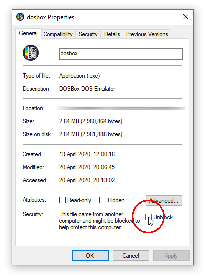

---
hide:
  - footer
---

# Windows builds

## Windows 8.x or newer

[Download DOSBox Staging 0.80.1 64-bit (Installer)][0_80_1_x64_INSTALLER]
 
<small>
sha256: 94b961f397f3b70a13daf3b573857b52<wbr>62515e75d490bfc19f019479fe1694f8
</small>

[Download DOSBox Staging 0.80.1 64-bit (zip)][0_80_1_x64_ZIP]
 
<small>
sha256: 3680cbdf7a91467877b51c95e468ef45<wbr>b186b42518c3163fab85c727923ee659
</small>

[Download DOSBox Staging 0.80.1 32-bit (zip)][0_80_1_x32_ZIP]
 
<small>
sha256: cd73b86699e9732bcee9fe33d4bc05e19262d0b1cc64478b18be9853fe28f083
</small>

Check out the [0.80.1 release notes](release-notes/0.80.1.md) to learn about
the changes and improvements introduced by this release.

!!! important

    If Windows 8.x or Windows 10 prevents you from running DOSBox Staging via
    Microsoft Defender SmartScreen, see the [section below](#microsoft-defender-smartscreen).

## Windows 7

For 64-bit Windows 7, use the 64-bit MSVC build. It can be optionally selected
in the [installer][0_80_1_x64_INSTALLER] and is also available as a [portable
ZIP archive][0_80_1_x64_ZIP].

For 32-bit Windows 7, use the 32-bit MSVC build [portable ZIP archive][0_80_1_x32_ZIP]

## Windows Vista

The official distribution packages only support Windows Vista up to version
0.78.1.

More recent releases can be built from the source by excluding FluidSynth and
Slirp support. Please see the [Windows MSYS2 build instructions][win-build]
for further details.

[win-build]: https://github.com/dosbox-staging/dosbox-staging/blob/main/docs/build-windows.md#build-using-msys2

## Hardware requirements

SSE 4.2 instruction set is required for version 0.75.1 or newer.

## Development snapshot builds

You can always see what's cooking on the main branch! :sunglasses: :beer:

These [snapshot builds](development-builds.md) might be slow or unstable as they
are designed with developers and testers in mind.

## Microsoft Defender SmartScreen

You'll need to do the following when launching DOSBox Staging for the first
time (you'll need to repeat these steps every time after having upgraded to a newer version).

### Method 1

Start the application, then click on **More info** in the appearing dialog.
Click the **Run anyway** button in the second dialog.

<figure markdown>
  
</figure>

<figure markdown>
  
</figure>

### Method 2

In your installation folder, right-click on the `dosbox.exe`, select **Properties**, tick
**Unblock** in the appearing dialog, then press **Ok**.

<figure markdown>
  
</figure>

### Explanation

Starting in Windows 8, [Microsoft Defender SmartScreen's](https://docs.microsoft.com/en-us/windows/security/threat-protection/windows-defender-smartscreen/windows-defender-smartscreen-overview
) pop-up encumbers the execution
of newly-developed applications.  To prevent this, developers are expected to pay
Microsoft's [EV certification](https://docs.microsoft.com/en-gb/archive/blogs/ie/microsoft-smartscreen-extended-validation-ev-code-signing-certificates) vendors a yearly fee and put the software on Windows
Store.

As DOSBox Staging is a volunteer effort, we are not in a position to make such
payments. We, therefore, ask users to manually unblock DOSBox Staging and be
patient while Microsoft's Application Reputation Scheme eventually whitelists
DOSBox Staging.

## Custom install parameters

The installer is built with [Inno Setup](https://jrsoftware.org/isinfo.php). For the available
command-line install parameters, please see [Inno's documentation page](https://jrsoftware.org/ishelp/index.php?topic=setupcmdline).

## Older builds

- [DOSBox Staging 0.80.0 64-bit (Installer)][0_80_0_x64_INSTALLER] (Windows 7 or newer)
   
  <small>
  sha256: 84445c869e58f6b4591484f6178c7b5b<wbr>3c8f284bf9460e9afc4502ba842ab039
  </small>

- [DOSBox Staging 0.80.0 64-bit (zip)][0_80_0_x64_ZIP] (Windows 7 or newer)
   
  <small>
  sha256: 075be379ed4475615e0e86953eb21f02<wbr>4c74b4cafd6914e9cf5ef40e3d9e26cd
  </small>

- [DOSBox Staging 0.79.1 64-bit (installer)][0_79_1_x64_INSTALLER] (Windows 7 or newer)
   
  <small>
  sha256: 0045ac995ada0af955681983ae86c969<wbr>a05030c25173618f8b1547a267046a27
  </small>

- [DOSBox Staging 0.79.1 64-bit (zip)][0_79_1_x64_ZIP] (Windows 7 or newer)
   
  <small>
  sha256: 8c7045dfea6dc20bb985cff516d2faee<wbr>51d2ecaf054db60632857b6941d3d648
  </small>

- [DOSBox Staging 0.79.0 64-bit (installer)][0_79_0_x64_INSTALLER] (Windows 7 or newer)
   
  <small>
  sha256: 154c663f76d0ca46d1d23d8c2bcea2d8<wbr>3717f1ba9103067a6a6f5ce814cf0cb2
  </small>

- [DOSBox Staging 0.79.0 64-bit (zip)][0_79_0_x64_ZIP] (Windows 7 or newer)
   
  <small>
  sha256: b3633d425489fbb5f6f9b3de75e4c2c6<wbr>dd0713c3aec504e42cac948cc1550bbe
  </small>

- [DOSBox Staging 0.78.1 64-bit (zip)][0_78_1_x64_MSYS2] (Windows Vista or newer)
   
  <small>
  sha256: 3c2f408125351154a37e93de8a4bd05d<wbr>0c722bbf53e1f583909e4ca6c3eb9204
  </small>

- [DOSBox Staging with built-in debugger 0.78.1 64-bit (zip)][0_78_1_x64_MSVC] (Windows Vista or newer)
   
  <small>
  sha256: b99f3c354f831ed2b0ed04d215170f69<wbr>6b6fc18285b0c7192c0abab62c41bbc8
  </small>

- [DOSBox Staging 0.78.0 64-bit (zip)][0_78_0_x64] (Windows Vista or newer)
   
  <small>
  sha256: f13cba664259fdb0db5e32826e13dcde<wbr>d4270557963f6e823a4731129f23a8a3
  </small>

- [DOSBox Staging 0.78.0 32-bit (zip)][0_78_0_x86] (Windows Vista or newer)
   
  <small>
  sha256: 0ca9201cdf3f3a1576b97b0de0e87280<wbr>b75c633976f0b179ba33a68d44f5ba56
  </small>

- [DOSBox Staging 0.77.1 64-bit (zip)][0_77_1_x64] (Windows Vista or newer)
   
  <small>
  sha256: 11ba992ece6d3e4ef2046fcdb6d842da<wbr>364b69720a921d61fdcc793eb52e7051
  </small>

- [DOSBox Staging 0.77.1 32-bit (zip)][0_77_1_x86] (Windows Vista or newer)
   
  <small>
  sha256: a34883101486ce2af071a29c6390f203<wbr>8889fc519e042101284f2a6999d9f0ef
  </small>

- [DOSBox Staging 0.77.0 64-bit (zip)][0_77_0_x64] (Windows Vista or newer)
   
  <small>
  sha256: cacdac418642fd8c7faf1e5955110c35<wbr>d0c207392ae20835707fd2a1e1114b82
  </small>

- [DOSBox Staging 0.77.0 32-bit (zip)][0_77_0_x86] (Windows Vista or newer)
   
  <small>
  sha256: f718d07bab69e3e1be0b28207039cea2<wbr>746c7e45b8ba7a19b625011f477e609a
  </small>

- [DOSBox Staging 0.76.0 32-bit (zip)][0_76_0_x86] (Windows Vista or newer)
   
  <small>
  sha256: 646d2f3fa8189e411589fedcb8148a29<wbr>5361693a6ce95d08e06f4a70e5a36b16
  </small>

- [DOSBox Staging 0.75.2 64-bit (zip)][0_75_2_x64] (Windows Vista or newer)
   
  <small>
  sha256: 09f0ca911813a64b8814880eb6e49ad4<wbr>dcdac9a5bb9263c4887ad82b71fad292
  </small>

- [DOSBox Staging 0.75.2 32-bit (zip)][0_75_2_x86] (Windows Vista or newer)
   
  <small>
  sha256: 51dc171ff52ea395c6a22f09ebb98a93<wbr>974a95c701ca81008368c22a66deced2
  </small>

- [DOSBox Staging 0.75.1 64-bit (zip)][0_75_1_x64] (Windows Vista or newer)
   
  <small>
  sha256: 80c60c4377ff2882649f113b3cb3bcd4<wbr>07c17acaac344c49fa1fc4229813f012
  </small>

- [DOSBox Staging 0.75.1 32-bit (zip)][0_75_1_x86] (Windows Vista or newer)
   
  <small>
  sha256: 843c742a348f575862e152e02cf174be<wbr>0ea1c52bdb6e4bffd65f34af88b566b7
  </small>

- [DOSBox Staging 0.75.0 32-bit (zip)][0_75_0_x86] (Windows Vista or newer, supports CPUs without SSE4.2)
   
  <small>
  sha256: 69046adcef2ef9920fbba8d40fc9e51f<wbr>3dd144ba4549787e1816cf1c2ae87d71
  </small>

- [DOSBox Staging 0.75.0-rc1 32-bit (zip)][0_75_0_rc1_x86] (Windows Vista or newer, supports CPUs without SSE4.2)
   
  <small>
  sha256: 738d2ae2101384f2eeaf1895de64cf1b<wbr>4c76eaf7873de7e15b7f52145dfed7e7
  </small>

[0_80_1_x64_INSTALLER]: https://github.com/dosbox-staging/dosbox-staging/releases/download/v0.80.1/dosbox-staging-v0.80.1-setup.exe
[0_80_1_x64_ZIP]: https://github.com/dosbox-staging/dosbox-staging/releases/download/v0.80.1/dosbox-staging-windows-x86_64-v0.80.1.zip
[0_80_1_x32_ZIP]: https://github.com/dosbox-staging/dosbox-staging/releases/download/v0.80.1/dosbox-staging-windows-x86_32-v0.80.1.zip
[0_80_0_x64_INSTALLER]: https://github.com/dosbox-staging/dosbox-staging/releases/download/v0.80.0/dosbox-staging-v0.80.0-setup.exe
[0_80_0_x64_ZIP]: https://github.com/dosbox-staging/dosbox-staging/releases/download/v0.80.0/dosbox-staging-windows-msys2-x86_64-v0.80.0.zip
[0_79_1_x64_INSTALLER]: https://github.com/dosbox-staging/dosbox-staging/releases/download/v0.79.1/dosbox-staging-v0.79.1-setup.exe
[0_79_1_x64_ZIP]: https://github.com/dosbox-staging/dosbox-staging/releases/download/v0.79.1/dosbox-staging-windows-x86_64-v0.79.1.zip
[0_79_0_x64_INSTALLER]: https://github.com/dosbox-staging/dosbox-staging/releases/download/v0.79.0/dosbox-staging-v0.79.0-setup.exe
[0_79_0_x64_ZIP]: https://github.com/dosbox-staging/dosbox-staging/releases/download/v0.79.0/dosbox-staging-windows-x86_64-v0.79.0.zip
[0_78_1_x64_MSYS2]: https://github.com/dosbox-staging/dosbox-staging/releases/download/v0.78.1/dosbox-staging-windows-msys2-x86_64-v0.78.1.zip
[0_78_1_x64_MSVC]: https://github.com/dosbox-staging/dosbox-staging/releases/download/v0.78.1/dosbox-staging-windows-x64-v0.78.1.zip
[0_78_0_x64]: https://github.com/dosbox-staging/dosbox-staging/releases/download/v0.78.0/dosbox-staging-windows-msys2-x86_64-v0.78.0.zip
[0_78_0_x86]: https://github.com/dosbox-staging/dosbox-staging/releases/download/v0.78.0/dosbox-staging-windows-msys2-i686-v0.78.0.zip
[0_77_1_x64]: https://github.com/dosbox-staging/dosbox-staging/releases/download/v0.77.1/dosbox-staging-windows-x64-v0.77.1.zip
[0_77_1_x86]: https://github.com/dosbox-staging/dosbox-staging/releases/download/v0.77.1/dosbox-staging-windows-x86-v0.77.1.zip
[0_77_0_x64]: https://github.com/dosbox-staging/dosbox-staging/releases/download/v0.77.0/dosbox-staging-windows-x64-v0.77.0.zip
[0_77_0_x86]: https://github.com/dosbox-staging/dosbox-staging/releases/download/v0.77.0/dosbox-staging-windows-x86-v0.77.0.zip
[0_76_0_x64]: https://github.com/dosbox-staging/dosbox-staging/releases/download/v0.76.0/dosbox-staging-windows-x64-v0.76.0.zip
[0_76_0_x86]: https://github.com/dosbox-staging/dosbox-staging/releases/download/v0.76.0/dosbox-staging-windows-x86-v0.76.0.zip
[0_75_2_x64]: https://github.com/dosbox-staging/dosbox-staging/releases/download/v0.75.2/dosbox-staging-windows-x64-v0.75.2.zip
[0_75_2_x86]: https://github.com/dosbox-staging/dosbox-staging/releases/download/v0.75.2/dosbox-staging-windows-x86-v0.75.2.zip
[0_75_1_x64]: https://github.com/dosbox-staging/dosbox-staging/releases/download/v0.75.1/dosbox-staging-windows-x64-v0.75.1.zip
[0_75_1_x86]: https://github.com/dosbox-staging/dosbox-staging/releases/download/v0.75.1/dosbox-staging-windows-x86-v0.75.1.zip
[0_75_0_x86]: https://github.com/dosbox-staging/dosbox-staging/releases/download/v0.75.0/dosbox-staging-windows-v0.75.0.zip
[0_75_0_rc1_x86]: https://github.com/dosbox-staging/dosbox-staging/releases/download/v0.75.0-rc1/dosbox-staging-windows-v0.75.0-rc1.zip

## Building from source

Of course, you can always [build DOSBox Staging straight from the source][4].

Send us patches if you improve something! :smile:

[4]:https://github.com/dosbox-staging/dosbox-staging

