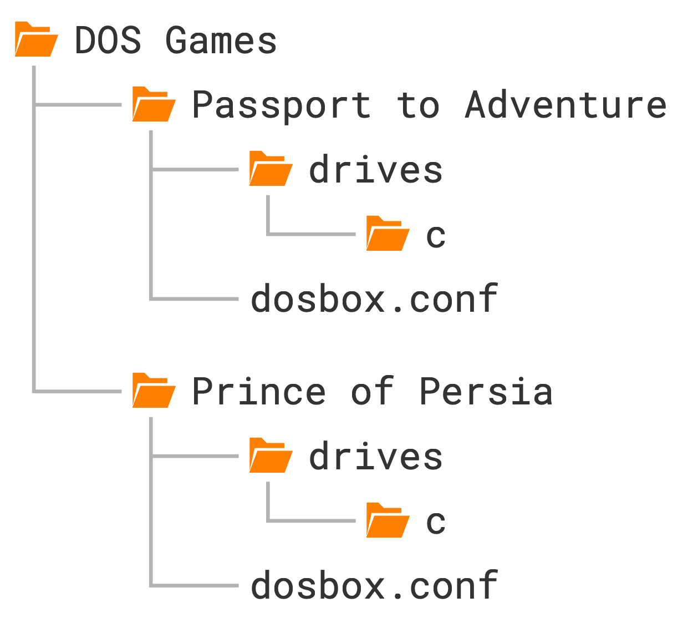

# Passport to Adventure

Okay, so what we'll set up next is not a single game, but a collection called
**Passport to Adventure** which contains playable demos of three classic
LucasArts point-and-click adventure games:
[Indiana Jones and the Last Crusade](https://www.mobygames.com/game/534/indiana-jones-and-the-last-crusade-the-graphic-adventure/),
[The Secret of Monkey Island](https://www.mobygames.com/game/616/the-secret-of-monkey-island/),
and [Loom](https://www.mobygames.com/game/176/loom/). These were the
blockbusters of the adventure gaming genre back in the day, and they still
offer countless hours of fun if you like puzzle-solving and well-written,
intriguing storylines.

But before we begin, let's discuss something fundamental to DOSBox Staging!


## Primary configuration

Have you wondered how do you learn about all the available configuration
settings? When you start DOSBox Staging for the very first time, it creates a
so-called *primary configuration* file in a standard location with the name
`dosbox-staging.conf`. This file contains the full list of available settings
with their default values and a short description for each.

For example, this is the start of the description of the `viewport` setting:

    Set the viewport size ('fit' by default). This is the maximum drawable area;
    the video output is always contained within the viewport while taking the
    configured aspect ratio into account (see 'aspect'). Possible values:
      fit:          Fit the viewport into the available window/screen (default).
                    There might be padding (black areas) around the image with
                    'integer_scaling' enabled.
      WxH:          Set a fixed viewport size in WxH format in logical units
                    (e.g., 960x720). The specified size must not be larger than
                    the desktop. If it's larger than the window size, it's
                    scaled to fit within the window.
      N%:           Similar to 'WxH' but the size is specified as a percentage
                    of the desktop size.
      ...

Here are the locations of `dosbox-staging.conf` on each platform:

<div class="compact" markdown>

| <!-- --> | <!-- -->
|----------|----------
| **Windows**  | `C:\Users\%USERNAME%\AppData\Local\DOSBox\dosbox-staging.conf`
| **macOS**    | `~/Library/Preferences/DOSBox/dosbox-staging.conf`
| **Linux**    | `~/.config/dosbox/dosbox-staging.conf`

</div>

!!! tip "Showing the Library folder in Finder"

     The `Library` folder is hidden by default in the macOS Finder. To make it
     visible, go to your home folder in Finder, press ++cmd+j++ to bring up
     the view options dialog, and then check *Show Library Folder*.

## Online help

If you know the exact name of a configuration setting, you can display its
explanatory text using the built-in `config` command. The invocation is
`config -h <setting_name>`. 

Let's see what `config -h viewport` gives us!

{ loading=lazy style="margin: 0.9rem 0;" }

That's a quite handy online help system, isn't it? As the bottom line
indicates, you can press ++space++ to go to the next page, ++enter++ to
advance to the next line, or ++q++ to quit the help viewer. The help viewer
will also automatically quit once we've reached the end of the output.

You can run `config -h <section_name>`, too, to get the names of all available
settings in a given config section. For example, this is the result of `config
-h render`:

TODO screenshot

It is highly recommended to look up the descriptions of the various settings
as you encounter them in this guide. That's a good way to get gradually
acquainted with the available options.


## Layered configurations

In our Prince of Persia example, we created a `dosbox.conf` configuration file
in the game's folder, then we started DOSBox Staging from that folder. In such
a scenario, DOSBox loads the _primary configuration_ first, then
applies the _local_ `dosbox.conf` _configuration_ found in the folder it was started
from (the game's folder). Because of this loading order, you can override
any primary config setting in your local config.

This *layered configuration* approach is very useful; you can apply broad,
general settings in your primary configuration that will apply to all games,
then fine-tune these defaults on a per-game basis via local `dosbox.conf`
configs in the individual game folders. Because of this, the primary
configuration is sometimes also referred to as the _default_ or _global
configuration_.

As DOSBox Staging comes with sensible defaults, you can keep these local
configs quite minimal, as we've already seen. There's absolutely no need to
specify every single setting in your local game-specific config---that would
make configurations very cumbersome to manage, plus it would be very difficult
to see what settings have been changed from their defaults for a particular
game.

!!! tip "A word of advice"

    It's best not to change the primary configuration while you're still a
    beginner. Even more experienced DOSBox users are generally better off
    changing the primary configuration very sparingly as those settings will
    affect all games.

    A few things that you might want to consider setting globally in the
    primary config include enabling fullscreen mode, turning on auto-pausing,
    integer scaling and shader defaults, and certain MIDI and audio-related
    settings (e.g., sample rate, buffer sizes, volume levels, etc.) We'll
    examine these later.


## Installing the game

Ok, so let's create the subfolder for our second game then! Create another
folder in `DOS Games` next to `Prince of Persia` and name it `Passport to
Adventure`. Create the `drives` subfolder in it and the `c` subfolder in the
`drives` folder.

Download the [ZIP archive](https://archive.org/download/PassportToAdventure/PassportToAdventuredemo1990lucasartsadventureCompilation.zip)
from the [Passport of Adventure](https://archive.org/details/PassportToAdventure) item at the
Internet Archive (or from this [mirror](https://files.dosbox-staging.org/Files/Games/Demos/PassportToAdventure.zip)),
then extract its contents into the `c` subfolder.

Below is the folder structure you should end up with. As explained before,
we'll create one subfolder within `DOS Games` for each game, then each game
folder will contain its own local `dosbox.conf` configuration specific to that
game, along with its own "emulated C drive" in the `drives/c` subfolder.

{ .skip-lightbox style="width: 14.75rem; margin: 0.3rem max(calc((50% - 14.75rem/2) * 0.85), 0rem);" }


## Examining text files

By poking around on the C drive a little bit with the `dir` command, we'll
quickly realise we only have two executables: `INSTALL.BAT` and `SAMPLER.EXE`.
But there's also a `README.TXT`, so let's check that one out first!

We can try displaying its contents with the `type README.TXT` command
(remember, use tab-completion), but we'll only see the end of the file that
way because it's longer than a single page. The `type` command prints out the
entire contents of the file, which will cause the screen to scroll, so we'll
effectively only see the last page. Yep, that's DOS for you!

Fortunately, there is a way to fix this: we can "pipe" the output of the `type` command
through the `more` command that will paginate the preceding command's output,
just like the `config` command does. The `|` is called the "pipe" character---how fitting! You can
type it by pressing ++shift+backslash++, which is located above the ++enter++
key on the standard US keyboard.

Okay, so let's try it! 

    type README.TXT | more

Now we can read the whole file, starting from the beginning. But there's an
easier way to accomplish the same thing: we can simply execute `more
README.TXT`. You can think of the `more` command as a more advanced,
paginating version of the `type` command.

Of course, you can always cheat and read such text files outside of DOSBox,
but we wanted to teach you something useful about DOS here.

The file contains important instructions about installing and playing the
game, including the list of available keyboard shortcuts, so read it
carefully. As it turns out, we'll only need to run `SAMPLER.EXE`, so let's
just do that!


## Mouse capture

If you're playing the game in windowed mode, you'll need to click on the
DOSBox Staging window first to "capture" the mouse so you can move the
crosshair-shaped in-game cursor.

To "release" the "captured" mouse cursor, middle-click on your mouse, or press
the ++ctrl+f10++ shortcut (++cmd+f10++ on macOS). The title bar of the DOSBox
Staging window informs you about the current mouse capture state.

It's also possible to tell DOSBox Staging to start with the mouse captured
(this might not work on all operating systems, though):

```ini
[mouse]
mouse_capture = onstart
```

## Playing the game

This is a really user-friendly program; you can press ++f1++ on the main
screen to read the general instructions, then start a game demo by clicking on
one of the three game icons on the left. Pressing ++f1++ during the game
displays further game-specific help; make sure you read them if you actually
want to play these demos. They're worth playing even if you intend to play the
full games later as the demos contain slightly different scenes, puzzles, and
dialogues, plus some fun easter-eggs.

For people who really don't like to read: ++f5++ brings up the save/load/quit
dialog, and you can pause/unpause the game with the ++space++ key.

Let's start with the first demo called "Indy" (**Indiana Jones and the Last
Crusade**), mainly because it plays a nice long version of the famous Indiana
Jones theme during the intro, and we're going to investigate the various sound
options next!


<div class="image-grid" markdown>

<figure markdown>
  <a class="glightbox" href="https://www.dosbox-staging.org/static/images/getting-started/indy3-title.png" >
    { loading=lazy .skip-lightbox }
  </a>

  <figcaption markdown>
  Indiana Jones and the Last Crusade --- Title screen
  </figcaption>
</figure>

<figure markdown>
  <a class="glightbox" href="https://www.dosbox-staging.org/static/images/getting-started/indy3-start.png" >
    { loading=lazy .skip-lightbox }
  </a>

  <figcaption markdown>
  Indiana Jones and the Last Crusade --- Opening scene
  </figcaption>
</figure>

</div>


## Sound options

### Sound Blaster / AdLib sound

The game managed to auto-detect our emulated Sound Blaster card, so what we're
hearing during the intro is AdLib music.

*"Whoa, let me stop you right there, dude! You said Sound Blaster, so what's
this AdLib thing now?!"*

Okay, we'll need to understand a few technical details again. Most Sound
Blaster cards support at least two sound generation mechanisms:

- **Playing digitised sounds** (sounds recorded from real-world sources, such
    as speech, sound effects, and sometimes even recorded music). This is
    referred to as *digital audio*, *digitised sound*, *sampled audio*, *PCM
    audio*, or just *voice* or *speech* in the game manuals and setup
    utilities (yes, it's all over the place; I'm sure there are a dozen more
    variations out there...)

- **Playing music and sound effects using a built-in synthesiser.** This is
    usually called *AdLib*, *OPL synthesiser*, *FM synthesiser*, simply just
    *music*, or somewhat confusingly *Sound Blaster MIDI*.

Storing music as a list of instructions for a synthesiser takes *very* little
disk space (think of sheet music), whereas storing digital audio eats disk
space for breakfast (think of uncompressed or even lossless audio files).
Consequently, the vast majority of DOS games use some kind of synthesiser for
music, and digital audio is generally reserved for sound effects and speech
only.

These game demos don't have any digital sound effects; they all just use the
OPL chip of the Sound Blaster for both music and some limited sound effects.
The game is clever enough to auto-detect our OPL-equipped Sound Blaster 16
(the default sound card emulated by DOSBox), so we'll get OPL sound by simply
starting `SAMPLER.EXE`.

Of course, we can enhance the OPL music by adding reverb and chorus effects to
it, just as we've done with Prince of Persia. Unless you're an absolute
purist, this is generally a good idea, especially when using headphones. We'll
only need to add a few lines to our config:

```ini
[mixer]
reverb = medium
chorus = normal
```

!!! note

    Prince of Persia can also auto-detect our Sound Blaster 16, but most games
    are not this clever. As we'll see in our later game examples, usually we
    need to manually configure the audio devices using the game's setup
    utility.


!!! info "1-minute Sound Blaster OPL synthesiser crash course"

    In case you're wondering:

    - **OPL** is just the name of the Yamaha OPL sound synthesiser chip present
        on most Sound Blaster cards.

    - **FM** refers to the type of sound synthesis the OPL chip is doing, which
        is Frequency Modulation synthesis (or FM synthesis, in short).

    - **AdLib** was an early sound card predating Sound Blasters that featured
        the same OPL chip. Perfect AdLib compatibility was one of the Sound
        Blasters' main selling points, therefore in games that support both
        AdLib and Sound Blaster for synthesised sound, both options will
        usually yield the exact same result.

        The AdLib card, however, had no support for digital audio, so it's
        preferable to pick the Sound Blaster option if the game offers both---
        you might also get digital speech and sound effects by doing so.

    - **Sound Blaster MIDI** is a weird thing. Most later games after 1992
        supported much higher quality MIDI sound modules that used sampled
        recordings of real-world instruments. Many of these also provided a
        fallback option to play the same MIDI music via the OPL chip, using
        synthesised approximations of the same instruments.

    All in all, the terms **OPL**, **AdLib**, and **FM** are used
    interchangeably in practice, and usually they refer to the exact same
    thing.


### PC speaker sound

The observant among you might have spotted the list of graphics and sound
configuration options in `README.TXT`. Playing with the graphics options is an
exercise for the reader; it should be easy to apply what we've learned while
setting up Prince of Persia.

The sound settings, however, are quite interesting. We can get the executable
to print out the list of available options by passing it some invalid
argument; `SAMPLER /?` seems to do the trick:

``` { . .dos-prompt }
C:\>SAMPLER.EXE /?
                                Interpreter Verson 4.0.62
Unknown flag: '/?'

Options:
         h      Hercules(tm) graphics
         c      CGA graphics
         t      Tandy(tm) graphics
         m      MCGA graphics
         e      EGA graphics
         v      VGA graphics
         k      Keyboard
         j      Joystick
         mo     Mouse
         i      Internal speaker
         ts     Tandy(tm) sounds
         g      Game Blaster(tm) sounds
         a      Adlib(tm) sounds
         d      Two disk drives

For example, in order to play with EGA Graphics and a mouse,
type: SAMPLER e mo
```

Okey-dokey, let's try the "internal speaker" option by starting the game with
the `i` command-line argument:

``` { . .dos-prompt }
C:\>SAMPLER.EXE i
```

Well, it does sound a lot worse, doesn't it?

DOSBox emulates the little *internal speaker* (also known as *PC speaker*)
that was a standard accessory of all PCs for a long time. It was designed to
only produce rather primitive bleeps and bloops, but certain games can coerce
it to play digitised sound by employing some cunning tricks. In any case, this
a bleepy-bloopy type of game...

It's hard to envision anyone *willingly* subjecting themselves to the internal
speaker experience when a game supports much better quality sound (even
nostalgia can't be that strong!) But in most games released before about 1988,
that's the only sound option you have.

For such early games, we can make the PC speaker a little more pleasant to
listen to by enabling the special `tiny` reverb preset. This has been
specifically designed for small-speaker audio systems; it simulates the sound
of a small integrated speaker in a domestic room. The improvement is
particularly noticeable with headphones.

```ini
[mixer]
reverb = tiny
```

### Tandy sound

Another option is the "Tandy\(tm\) sounds" you can select with the `ts`
command-line argument. Let's try it!

``` { . .dos-prompt }
C:\>SAMPLER.EXE ts
```

Aaaaand, now there's no sound at all. Why is that?

Tandy Corporation was an IBM PC clone manufacturer in the 1980s; they produced
the Tandy line of home computers that were mostly compatible with standard PCs
but also offered improved sound and graphics capabilities. Developers had to
specifically support the Tandy to take advantage of these features. There are
relatively few such games, but they are worth seeking out as they provide
a better experience, especially in the sound department. The
[Games with enhanced Tandy & PCjr graphics and sound](https://github.com/dosbox-staging/dosbox-staging/wiki/Games-with-enhanced-Tandy-&-PCjr-graphics-and-sound)
page on our wiki should help you find these pre-1990 Tandy specials.

DOSBox can emulate a Tandy machine---we only need to instruct it to do so in
our config:

```ini
[dosbox]
machine = tandy
```

Emulating the Tandy will cause the standard DOS font to be a bit different;
this is normal, so don't be alarmed by it.

After a restart, we're finally hearing different synthesised music which
sounds definitely better than the PC speaker rendition, but not as good as the
OPL music. Interestingly, the Tandy music plays a little bit faster than the
other sound options.

!!! note

    If you started `SAMPLER.EXE` without providing the `ts` argument to
    specifically ask for Tandy sound, the game will auto-detect the Sound
    Blaster's OPL synthesiser and prefer it over the Tandy sound. That's
    understandable; the game is really good at picking the best available
    sound device!

    As an exercise, you can disable the Sound Blaster emulation altogether
    with the below config snippet. Then you can start `SAMPLER.EXE` without
    any arguments, and the game will use Tandy sound as that's the best
    available option (the PC speaker would be the only other alternative):

    ```ini
    [sblaster]
    sbtype = none
    ```

### Game Blaster / CMS sound

The demos also support the *Game Blaster*, which is one of the earliest PC
sound cards developed by Creative Technologies, the folks responsible for the
Sound Blaster family of cards. The Game Blaster was also sold under the name
*Creative Music System*, or just *CMS* for short.

To enable it, we'll need to set the emulated Sound Blaster type (`sbtype`) to
Game Blaster (`gb`), and the game will auto-detect it correctly. As the Game
Blaster is the precursor of the Sound Blaster lineup, it kind of makes sense
to lump it into the same category under the `sbtype` setting.

```ini
[sblaster]
sbtype = gb
```

The Game Blaster has a different-sounding synthesiser. Apart from its nice
pure sound, another of its characteristics is that the voices play either
completely on the left or on the right channel, making the music somewhat
difficult to listen to through headphones. This can be easily remedied by
enabling the `crossfeed` option which mixes a certain percentage of the left
channel into the right, and vice versa:

```ini
[mixer]
crossfeed = on
```

Naturally, you can combine crossfeed with chorus and reverb. You can also set
`crossfeed` to `light`, `normal`, or `strong` according to your preference, or
specify a custom crossfeed amount as a percentage from 0% (no crossfeed) to
100% (collapse the stereo image to mono):

```ini
crossfeed = 50
```

Try it with headphones; the improvement is very noticeable!


## "True EGA" emulation

Many classic graphic adventure games, including most of the early Sierra and
LucasArts catalogue and this collection of game demos, feature EGA graphics.
The most commonly used EGA screen mode in games is 320&times;200 with a fixed
16-colour palette.

EGA monitors had visible "fat" scanlines and the pixels were a bit round,
whereas later VGA monitors displayed EGA graphics without strong scanlines,
and the pixels appeared as little sharp rectangles. It's as if EGA monitors
had a "built-in filter" that smoothed the image somewhat while adding a subtle
texture to it as well, making it more interesting and pleasant to look at.
Later VGA cards and monitors offered backward compatibility with EGA graphics,
although this was not full compatibility but a kind of emulation: 320&times;200 EGA
graphics were simply line and pixel-doubled to 640&times;400.

VGA-style line-doubling changes the feel of EGA graphics, and many prefer the
original EGA look. After all, this is what the artists saw on their screens
when creating the artwork. Because of this, the authentic CRT emulation
feature displays EGA graphics with the "true EGA look" out of the box with the
`glshader = crt-auto` setting.

However, if you grew up with a VGA-equipped PC, then you only ever saw EGA
games double-scanned. To appease such people, you can instruct DOSBox Staging
to emulate a double-scanning VGA card in all screen modes with the
`crt-auto-machine` setting:

```ini
[render]
glshader = crt-auto-machine
```

Technically, this setting instructs DOSBox Staging to always emulate a CRT
monitor appropriate for the configured `machine` type which is VGA by
default.

The below screenshots illustrate the difference between the "true EGA" and
"EGA as displayed on VGA" look:


<div class="image-grid" markdown>

<figure markdown>
  <a class="glightbox" href="https://www.dosbox-staging.org/static/images/getting-started/indy3-ingame-vga.png" >
    { loading=lazy .skip-lightbox }
  </a>

  <figcaption markdown>
  Indiana Jones and the Last Crusade ---<br>EGA as displayed on VGA monitors
  </figcaption>
</figure>

<figure markdown>
  <a class="glightbox" href="https://www.dosbox-staging.org/static/images/getting-started/indy3-ingame-ega.jpg" >
    { loading=lazy .skip-lightbox }
  </a>

  <figcaption markdown>
  Indiana Jones and the Last Crusade ---<br>"True EGA" emulation
  </figcaption>
</figure>

</div>

<div class="image-grid" markdown>

<figure markdown>
  <a class="glightbox" href="https://www.dosbox-staging.org/static/images/getting-started/monkey-ingame-vga.jpg" >
    { loading=lazy .skip-lightbox }
  </a>

  <figcaption markdown>
  The Secret of Monkey Island ---<br>EGA as displayed on VGA monitors
  </figcaption>
</figure>

<figure markdown>
  <a class="glightbox" href="https://www.dosbox-staging.org/static/images/getting-started/monkey-ingame-ega.jpg" >
    { loading=lazy .skip-lightbox }
  </a>

  <figcaption markdown>
  The Secret of Monkey Island ---<br>"True EGA" emulation
  </figcaption>
</figure>

</div>

<div class="image-grid" markdown>

<figure markdown>
  <a class="glightbox" href="https://www.dosbox-staging.org/static/images/getting-started/loom-ingame-vga.jpg" >
    { loading=lazy .skip-lightbox }
  </a>

  <figcaption markdown>
  Loom --- EGA as displayed on VGA monitors
  </figcaption>
</figure>

<figure markdown>
  <a class="glightbox" href="https://www.dosbox-staging.org/static/images/getting-started/loom-ingame-ega.jpg" >
    { loading=lazy .skip-lightbox }
  </a>

  <figcaption markdown>
  Loom --- "True EGA" emulation
  </figcaption>
</figure>

</div>


!!! info "On recolouring the classics"

    Some adventure games that originally supported EGA graphics only got later
    VGA remakes. While many of these VGA versions are competent, they rarely
    reach the artistic genius of the EGA originals, plus often they don't have
    the exact same gameplay either. This is especially true for the three
    classic LucasArts games included in this demo collection. Check out the
    comparison and analysis of the EGA versus VGA versions of **Indiana Jones
    and the Last Crusade** and **Loom**
    [here](https://www.superrune.com/tutorials/lucasfilm_ega.php).

    In [another article](https://www.arcadeattack.co.uk/brian-moriarty/),
    Brian Moriatry, the creator of **Loom**, shares his opinion about the VGA
    remake of the game (he calls it "an abomination", so apparently he's quite
    unimpressed...) Note that about one third of the original game's dialogue
    had been cut from the VGA remake.

    In any case, the point here is it would be a mistake to outright dismiss
    the original EGA games, thinking they are "inferior" somehow. Even
    if you might prefer the VGA remakes in the end, you should at least give
    the EGA versions a chance to experience the creators' original vision.


## Authentic image size

DOS games appear overly blocky at fullscreen on 24" or larger modern monitors.
This is not how people experienced these games back in the day. Typical
monitor sizes were 14-15" throughout the 320&times;200 VGA era, and 17-19" for
the brief 640&times;480 SVGA period at the end of the DOS days.

We can make the image a bit smaller with the following setting:

```ini
[render]
viewport = 89%
```

This will result in an image size that is the best compromise between "modern
sensibilities" and the authentic original experience. It's still on the large
end of the spectrum, but not overly so. If you go higher than this, the
graphics will start looking overly blocky from a normal viewing distance.

The rationale behind the "magic 89% value" is explained in detail in the last
[advanced graphics options](advanced-graphics-options.md#custom-viewport-resolution) chapter.


## CPU sensitive games

Certain older games, such as these three demos, are sensitive to CPU speed.


This can manifest in different ways:

- The game may run too fast or may generally act weird if the emulated CPU is
  too fast (the more common case).

- The game may fail the sound card detection and won't even start up (that's
  rarer).

This game falls into the second category. Note we're talking about the speed
of the *emulated CPU* here, not the speed of the physical CPU in your
computer!

DOSBox defaults to emulating 3000 CPU instructions, or *CPU cycles*, per
millisecond. For the more technically inclined among you, this corresponds to
~3 MIPS (Million Instructions Per Second). When running in windowed mode, the
text in the title bar informs you about the current cycles value, e.g.:

```
DOSBox Staging - 3000 cycles/ms - to capture the mouse press...
```

Let's see what happens if we double the emulated CPU speed!

```ini
[cpu]
cpu_cycles = 6000
```

Now we're greeted by an error when trying to start the game:

``` { . .dos-prompt }
run-time error R6003
- integer divide by 0

C:\>
```

These problems happen because the game's creators did not anticipate the
massive advancements in consumer CPU technology that started at the beginning
of the 1990s (CPU power roughly doubling every three years). This is not too
surprising as this is a 1990 release. Later DOS games tended to be more
resilient to wildly varying CPU speeds as more programmers became aware of the
issue, but many games from the 1980s and the early 90s are affected.

We will discuss the CPU speed settings in more detail
[in the next chapter](beneath-a-steel-sky.md#adjusting-the-emulated-cpu-speed),
but it was worth mentioning this interesting quirk here.


## Final configuration

Here's the full config with all variations included as comments:

```ini
[sdl]
fullscreen = on

[dosbox]
# uncomment for Tandy sound
#machine = tandy

[mouse]
mouse_capture = onstart

[render]
viewport = 89%
# uncomment for double-scanned VGA CRT emulation
#glshader = crt-auto-machine

[sblaster]
# uncomment for Game Blaster audio
#sbtype = gb

[mixer]
# change 'reverb' to 'tiny' for the PC speaker
reverb = medium
chorus = normal
crossfeed = on

[autoexec]
c:
# use for PC speaker sound
#sampler i

# use for Tandy sound
#sampler ts

sampler
exit
```

