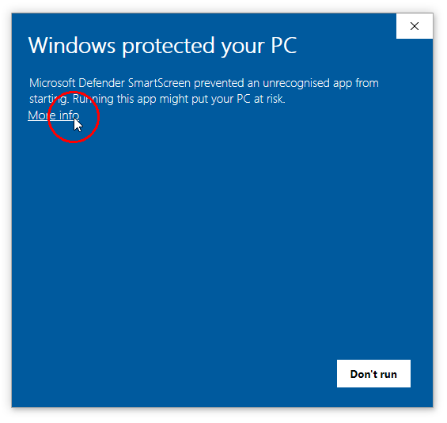
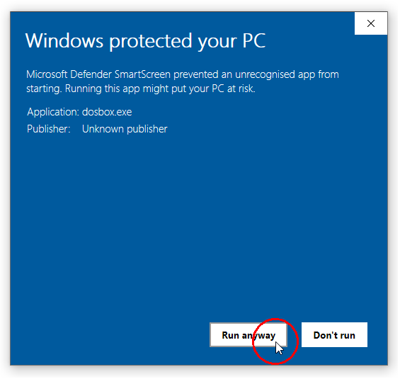
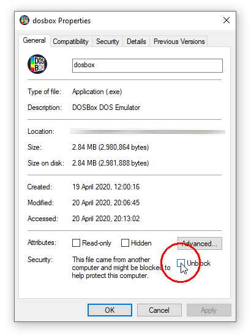

---
hide:
  - footer
---

# Windows releases

## Current stable version

<section class="release-downloads" markdown>

- [Download DOSBox Staging 0.82.1 (x86_64, Installer)][0_82_1_INSTALLER]
   
  <small>
  sha256: TODO<wbr>TODO

  </small>

- [Download DOSBox Staging 0.82.1 (x86_64, Portable ZIP)][0_82_1_ZIP]
   
  <small>
  sha256: TODO<wbr>TODO
  </small>

</section>

DOSBox Staging requires **64-bit Windows 8, 10, or 11**.

Check out the [0.82.1 release notes](release-notes/0.82.1.md) to learn about
the changes and improvements introduced in this release.

If you're new to DOSBox Staging, we highly recommend following the
[Getting started guide](../getting-started/index.md).

!!! important

    If Windows Security prevents you from running DOSBox Staging via **Windows
    Defender SmartScreen** (the built-in Windows antivirus), please follow
    [these instructions](#windows-defender).

## Hardware requirements

An x86 processor with SSSE3 (Supplemental Streaming SIMD Extensions 3) is
required.

## Legacy Windows support

If you're still on a legacy Windows version, you can use the following older
releases. Note these earlier version come with _zero official support_; the
core team won't be able to help you if you run into issues. Our recommendation
will always be to upgrade your Windows and use the latest stable version.

### Windows 8/10 32-bit

The official distribution packages only support 32-bit Windows 8 or 10 up to
version 0.80.1:

- For 32-bit Windows 8 or 10, use the [0.80.1 portable ZIP package][0_80_1_x32_ZIP].

- For 64-bit Windows 8 or 10, use the [current stable version](#current-stable-version).

### Windows 7

The official distribution packages only support Windows 7 up to version
0.80.1:

- For 64-bit Windows 7, use the [0.80.1 installer][0_80_1_x64_INSTALLER] and
  select the MSVC build, or the [0.80.1 portable ZIP package][0_80_1_x64_ZIP].

- For 32-bit Windows 7, use the [0.80.1 portable ZIP package][0_80_1_x32_ZIP].

### Windows Vista

The official distribution packages only support Windows Vista up to version
0.78.1.

## Development snapshot builds

You can always see what's cooking on the main branch! :sunglasses: :beer:

These [snapshot builds](development-builds.md) might be slow or unstable as they
are designed with developers and testers in mind.

## Experimental Windows ARM64 builds

We started providing experimental Windows ARM64 packages for devices such as
the Snapdragon X Elite. Note we don't provide any official support for these
builds yet.

The ARM64 packages can be downloaded from our [development builds](development-builds.md) page.

## Windows Defender

Windows Defender (the built-in Windows antivirus starting from Windows 8)
might prevent you from running DOSBox Staging when you start it for the first
time.

This is a false positive; DOSBox Staging has no malicious code whatsoever,
just antivirus software tend to be mistakenly flag emulators as "malware".

If this happens, please follow the below steps to grant Windows permission to
run DOSBox Staging. You may need to repeat these steps after upgrading
to a newer version.

### Method 1

Start the application, then click on **More info** in the appearing dialog.
Click the **Run anyway** button in the second dialog.

<figure markdown>
  
</figure>

<figure markdown>
  
</figure>

Consider also performing [Method 3](#method-3) to make DOSBox Staging start up
faster.

### Method 2

In your installation folder, right-click on the `dosbox.exe`, select **Properties**, tick
**Unblock** in the appearing dialog, then press **Ok**.

<figure markdown>
  
</figure>

Consider also performing [Method 3](#method-3) to make DOSBox Staging start up
faster.

### Method 3

Add an exclusion to Windows Security to whitelist the DOSBox Staging
executable or the folder in which it resides. We recommend doing so even if
you've already performed either of the previous methods, as it can eliminate
the 3--5 second startup delay caused by the real-time antivirus scan.

See the steps on how to do this [here](https://support.microsoft.com/en-au/windows/add-an-exclusion-to-windows-security-811816c0-4dfd-af4a-47e4-c301afe13b26)
and [here](https://docs.rackspace.com/docs/set-windows-defender-folder-exclusions).

### Explanation

Starting in Windows 8, [Microsoft Defender SmartScreen's](https://docs.microsoft.com/en-us/windows/security/threat-protection/windows-defender-smartscreen/windows-defender-smartscreen-overview
) pop-up encumbers the execution
of newly-developed applications.  To prevent this, developers are expected to pay
Microsoft's [EV certification](https://docs.microsoft.com/en-gb/archive/blogs/ie/microsoft-smartscreen-extended-validation-ev-code-signing-certificates) vendors a yearly fee and put the software on Windows
Store.

As DOSBox Staging is a volunteer effort, we are not in a position to make such
payments. We, therefore, ask users to manually unblock DOSBox Staging and be
patient while Microsoft's Application Reputation Scheme eventually whitelists
DOSBox Staging.

## Custom install parameters

The installer is built with [Inno Setup](https://jrsoftware.org/isinfo.php). For the available
command-line install parameters, please see [Inno's documentation page](https://jrsoftware.org/ishelp/index.php?topic=setupcmdline).

## Older releases

- [Download DOSBox Staging 0.82.0 (x86_64, Installer)][0_82_0_INSTALLER]
   
  <small>
  sha256: fa041173e55fba9873be0a85734a09a3<wbr>f54b466c95ff8f1b8aa1a84cd3347729
  </small>

- [Download DOSBox Staging 0.82.0 (x86_64, Portable ZIP)][0_82_0_ZIP]
   
  <small>
  sha256: b558efff258a7bd5f05cf61f1fddffcd<wbr>e8385e04c9b27bb29854bd13a708fbe1
  </small>

- [Download DOSBox Staging 0.81.2 (x86_64, Installer)][0_81_2_INSTALLER] (Windows 8 or newer)
   
  <small>
  sha256: 7c23512666f694420e5e2612742de5fb<wbr>64b32d336e54359b65fd21e7107ef51c
  </small>

- [Download DOSBox Staging 0.81.2 (x86_64, Portable ZIP)][0_81_2_ZIP] (Windows 8 or newer)
   
  <small>
  sha256: d7ec6054ae58d287c3ad5fbf4c3df732<wbr>ea3fd75ae828c8f4481fcf7c6203d168
  </small>

- [DOSBox Staging 0.81.1 (Installer)][0_81_1_INSTALLER] (Windows 8 or newer)
   
  <small>
  sha256: 4bb5e63bfef41d4a6ee8f7af3b8c5ee6<wbr>756987c4247197db0b16d888c6ac0705
  </small>

- [DOSBox Staging 0.81.1 (Portable ZIP)][0_81_1_ZIP] (Windows 8 or newer)
   
  <small>
  sha256: cb45e4e56b85cac7b8b1eb63a1bbd934<wbr>30a226215a5c04f2700076c279d10e12
  </small>

- [DOSBox Staging 0.81.0 (Installer)][0_81_0_INSTALLER] (Windows 8 or newer)
   
  <small>
  sha256: 7de2cbdd8b320017dcf904c3df58b150<wbr>88047954b053757c870279cbbb301393
  </small>

- [DOSBox Staging 0.81.0 (Portable ZIP)][0_81_0_ZIP] (Windows 8 or newer)
   
  <small>
  sha256: ce772a963716d63610e6cb0e817b16f1<wbr>b5a3cbfd3d5ad802726ddd583f32b79d
  </small>

- [DOSBox Staging 0.80.1 64-bit (Installer)][0_80_1_x64_INSTALLER] (Windows 8 or newer)
   
  <small>
  sha256: 94b961f397f3b70a13daf3b573857b52<wbr>62515e75d490bfc19f019479fe1694f8
  </small>

- [DOSBox Staging 0.80.1 64-bit (Portable ZIP)][0_80_1_x64_ZIP] (Windows 8 or newer)
   
  <small>
  sha256: e7ab98013b55f6fd6db1f529574b8f29<wbr>05d374225f532ce0905666281cbe32af
  </small>

- [DOSBox Staging 0.80.1 32-bit (Portable ZIP)][0_80_1_x32_ZIP] (Windows 8 or newer)
   
  <small>
  sha256: 63a8c5b084231364961f7c8b6415e446<wbr>22c5ab9822e49839c2aca1bddd3a9459
  </small>

- [DOSBox Staging 0.80.0 64-bit (Installer)][0_80_0_x64_INSTALLER] (Windows 7 or newer)
   
  <small>
  sha256: 84445c869e58f6b4591484f6178c7b5b<wbr>3c8f284bf9460e9afc4502ba842ab039
  </small>

- [DOSBox Staging 0.80.0 64-bit (Portable ZIP)][0_80_0_x64_ZIP] (Windows 7 or newer)
   
  <small>
  sha256: 075be379ed4475615e0e86953eb21f02<wbr>4c74b4cafd6914e9cf5ef40e3d9e26cd
  </small>

- [DOSBox Staging 0.79.1 64-bit (Installer)][0_79_1_x64_INSTALLER] (Windows 7 or newer)
   
  <small>
  sha256: 0045ac995ada0af955681983ae86c969<wbr>a05030c25173618f8b1547a267046a27
  </small>

- [DOSBox Staging 0.79.1 64-bit (Portable ZIP)][0_79_1_x64_ZIP] (Windows 7 or newer)
   
  <small>
  sha256: 8c7045dfea6dc20bb985cff516d2faee<wbr>51d2ecaf054db60632857b6941d3d648
  </small>

- [DOSBox Staging 0.78.1 64-bit (Portable ZIP)][0_78_1_x64_MSYS2] (Windows Vista or newer)
   
  <small>
  sha256: 3c2f408125351154a37e93de8a4bd05d<wbr>0c722bbf53e1f583909e4ca6c3eb9204
  </small>

- [DOSBox Staging with built-in debugger 0.78.1 64-bit (Portable ZIP)][0_78_1_x64_MSVC] (Windows Vista or newer)
   
  <small>
  sha256: b99f3c354f831ed2b0ed04d215170f69<wbr>6b6fc18285b0c7192c0abab62c41bbc8
  </small>

- [DOSBox Staging 0.78.0 64-bit (Portable ZIP)][0_78_0_x64] (Windows Vista or newer)
   
  <small>
  sha256: f13cba664259fdb0db5e32826e13dcde<wbr>d4270557963f6e823a4731129f23a8a3
  </small>

- [DOSBox Staging 0.78.0 32-bit (Portable ZIP)][0_78_0_x86] (Windows Vista or newer)
   
  <small>
  sha256: 0ca9201cdf3f3a1576b97b0de0e87280<wbr>b75c633976f0b179ba33a68d44f5ba56
  </small>

- [DOSBox Staging 0.77.1 64-bit (Portable ZIP)][0_77_1_x64] (Windows Vista or newer)
   
  <small>
  sha256: 11ba992ece6d3e4ef2046fcdb6d842da<wbr>364b69720a921d61fdcc793eb52e7051
  </small>

- [DOSBox Staging 0.77.1 32-bit (Portable ZIP)][0_77_1_x86] (Windows Vista or newer)
   
  <small>
  sha256: a34883101486ce2af071a29c6390f203<wbr>8889fc519e042101284f2a6999d9f0ef
  </small>

- [DOSBox Staging 0.77.0 64-bit (Portable ZIP)][0_77_0_x64] (Windows Vista or newer)
   
  <small>
  sha256: cacdac418642fd8c7faf1e5955110c35<wbr>d0c207392ae20835707fd2a1e1114b82
  </small>

- [DOSBox Staging 0.77.0 32-bit (Portable ZIP)][0_77_0_x86] (Windows Vista or newer)
   
  <small>
  sha256: f718d07bab69e3e1be0b28207039cea2<wbr>746c7e45b8ba7a19b625011f477e609a
  </small>

- [DOSBox Staging 0.76.0 32-bit (Portable ZIP)][0_76_0_x86] (Windows Vista or newer)
   
  <small>
  sha256: 646d2f3fa8189e411589fedcb8148a29<wbr>5361693a6ce95d08e06f4a70e5a36b16
  </small>

- [DOSBox Staging 0.75.2 64-bit (Portable ZIP)][0_75_2_x64] (Windows Vista or newer)
   
  <small>
  sha256: 09f0ca911813a64b8814880eb6e49ad4<wbr>dcdac9a5bb9263c4887ad82b71fad292
  </small>

- [DOSBox Staging 0.75.2 32-bit (Portable ZIP)][0_75_2_x86] (Windows Vista or newer)
   
  <small>
  sha256: 51dc171ff52ea395c6a22f09ebb98a93<wbr>974a95c701ca81008368c22a66deced2
  </small>

- [DOSBox Staging 0.75.1 64-bit (Portable ZIP)][0_75_1_x64] (Windows Vista or newer)
   
  <small>
  sha256: 80c60c4377ff2882649f113b3cb3bcd4<wbr>07c17acaac344c49fa1fc4229813f012
  </small>

- [DOSBox Staging 0.75.1 32-bit (Portable ZIP)][0_75_1_x86] (Windows Vista or newer)
   
  <small>
  sha256: 843c742a348f575862e152e02cf174be<wbr>0ea1c52bdb6e4bffd65f34af88b566b7
  </small>

- [DOSBox Staging 0.75.0 32-bit (Portable ZIP)][0_75_0_x86] (Windows Vista or newer, supports CPUs without SSE4.2)
   
  <small>
  sha256: 69046adcef2ef9920fbba8d40fc9e51f<wbr>3dd144ba4549787e1816cf1c2ae87d71
  </small>

- [DOSBox Staging 0.75.0-rc1 32-bit (Portable ZIP)][0_75_0_rc1_x86] (Windows Vista or newer, supports CPUs without SSE4.2)
   
  <small>
  sha256: 738d2ae2101384f2eeaf1895de64cf1b<wbr>4c76eaf7873de7e15b7f52145dfed7e7
  </small>

[0_82_1_INSTALLER]: https://github.com/dosbox-staging/dosbox-staging/releases/download/v0.82.1/dosbox-staging-windows-x64-v0.82.1-setup.exe
[0_82_1_ZIP]: https://github.com/dosbox-staging/dosbox-staging/releases/download/v0.82.1/dosbox-staging-windows-x64-v0.82.1.zip
[0_82_0_INSTALLER]: https://github.com/dosbox-staging/dosbox-staging/releases/download/v0.82.0/dosbox-staging-windows-x64-v0.82.0-setup.exe
[0_82_0_ZIP]: https://github.com/dosbox-staging/dosbox-staging/releases/download/v0.82.0/dosbox-staging-windows-x64-v0.82.0.zip
[0_81_2_INSTALLER]: https://github.com/dosbox-staging/dosbox-staging/releases/download/v0.81.2/dosbox-staging-windows-v0.81.2-setup.exe
[0_81_2_ZIP]: https://github.com/dosbox-staging/dosbox-staging/releases/download/v0.81.2/dosbox-staging-windows-v0.81.2.zip
[0_81_1_INSTALLER]: https://github.com/dosbox-staging/dosbox-staging/releases/download/v0.81.1/dosbox-staging-windows-v0.81.1-setup.exe
[0_81_1_ZIP]: https://github.com/dosbox-staging/dosbox-staging/releases/download/v0.81.1/dosbox-staging-windows-v0.81.1.zip
[0_81_0_INSTALLER]: https://github.com/dosbox-staging/dosbox-staging/releases/download/v0.81.0/dosbox-staging-windows-v0.81.0-setup.exe
[0_81_0_ZIP]: https://github.com/dosbox-staging/dosbox-staging/releases/download/v0.81.0/dosbox-staging-windows-v0.81.0.zip
[0_80_1_x64_INSTALLER]: https://github.com/dosbox-staging/dosbox-staging/releases/download/v0.80.1/dosbox-staging-v0.80.1-setup.exe
[0_80_1_x64_ZIP]: https://github.com/dosbox-staging/dosbox-staging/releases/download/v0.80.1/dosbox-staging-windows-x86_64-v0.80.1.zip
[0_80_1_x32_ZIP]: https://github.com/dosbox-staging/dosbox-staging/releases/download/v0.80.1/dosbox-staging-windows-x86_32-v0.80.1.zip
[0_80_0_x64_INSTALLER]: https://github.com/dosbox-staging/dosbox-staging/releases/download/v0.80.0/dosbox-staging-v0.80.0-setup.exe
[0_80_0_x64_ZIP]: https://github.com/dosbox-staging/dosbox-staging/releases/download/v0.80.0/dosbox-staging-windows-msys2-x86_64-v0.80.0.zip
[0_79_1_x64_INSTALLER]: https://github.com/dosbox-staging/dosbox-staging/releases/download/v0.79.1/dosbox-staging-v0.79.1-setup.exe
[0_79_1_x64_ZIP]: https://github.com/dosbox-staging/dosbox-staging/releases/download/v0.79.1/dosbox-staging-windows-x86_64-v0.79.1.zip
[0_78_1_x64_MSYS2]: https://github.com/dosbox-staging/dosbox-staging/releases/download/v0.78.1/dosbox-staging-windows-msys2-x86_64-v0.78.1.zip
[0_78_1_x64_MSVC]: https://github.com/dosbox-staging/dosbox-staging/releases/download/v0.78.1/dosbox-staging-windows-x64-v0.78.1.zip
[0_78_0_x64]: https://github.com/dosbox-staging/dosbox-staging/releases/download/v0.78.0/dosbox-staging-windows-msys2-x86_64-v0.78.0.zip
[0_78_0_x86]: https://github.com/dosbox-staging/dosbox-staging/releases/download/v0.78.0/dosbox-staging-windows-msys2-i686-v0.78.0.zip
[0_77_1_x64]: https://github.com/dosbox-staging/dosbox-staging/releases/download/v0.77.1/dosbox-staging-windows-x64-v0.77.1.zip
[0_77_1_x86]: https://github.com/dosbox-staging/dosbox-staging/releases/download/v0.77.1/dosbox-staging-windows-x86-v0.77.1.zip
[0_77_0_x64]: https://github.com/dosbox-staging/dosbox-staging/releases/download/v0.77.0/dosbox-staging-windows-x64-v0.77.0.zip
[0_77_0_x86]: https://github.com/dosbox-staging/dosbox-staging/releases/download/v0.77.0/dosbox-staging-windows-x86-v0.77.0.zip
[0_76_0_x64]: https://github.com/dosbox-staging/dosbox-staging/releases/download/v0.76.0/dosbox-staging-windows-x64-v0.76.0.zip
[0_76_0_x86]: https://github.com/dosbox-staging/dosbox-staging/releases/download/v0.76.0/dosbox-staging-windows-x86-v0.76.0.zip
[0_75_2_x64]: https://github.com/dosbox-staging/dosbox-staging/releases/download/v0.75.2/dosbox-staging-windows-x64-v0.75.2.zip
[0_75_2_x86]: https://github.com/dosbox-staging/dosbox-staging/releases/download/v0.75.2/dosbox-staging-windows-x86-v0.75.2.zip
[0_75_1_x64]: https://github.com/dosbox-staging/dosbox-staging/releases/download/v0.75.1/dosbox-staging-windows-x64-v0.75.1.zip
[0_75_1_x86]: https://github.com/dosbox-staging/dosbox-staging/releases/download/v0.75.1/dosbox-staging-windows-x86-v0.75.1.zip
[0_75_0_x86]: https://github.com/dosbox-staging/dosbox-staging/releases/download/v0.75.0/dosbox-staging-windows-v0.75.0.zip
[0_75_0_rc1_x86]: https://github.com/dosbox-staging/dosbox-staging/releases/download/v0.75.0-rc1/dosbox-staging-windows-v0.75.0-rc1.zip

## Building from source

Of course, you can always [build DOSBox Staging straight from the source][4].

Send us patches if you improve something! :smile:

[4]:https://github.com/dosbox-staging/dosbox-staging

